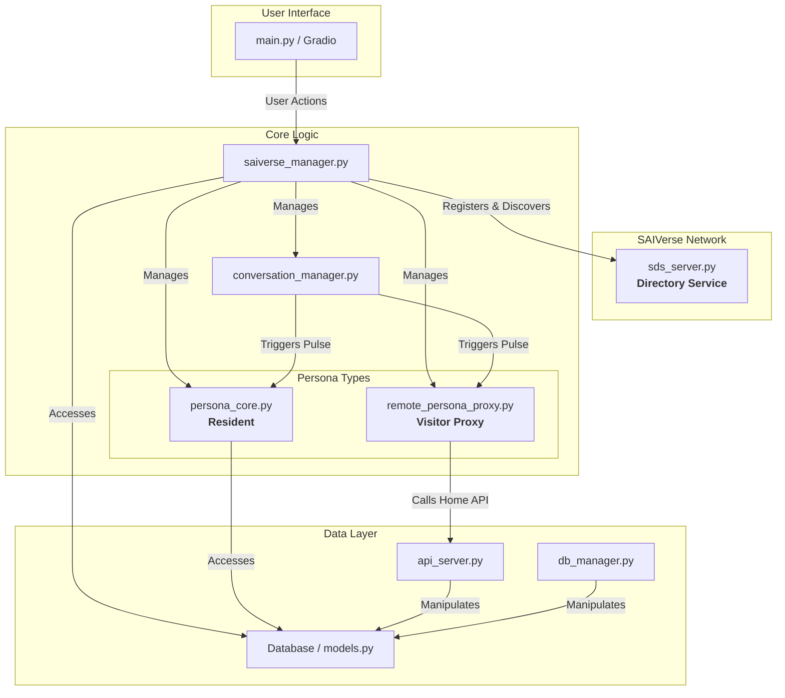

# SAIVerse アーキテクチャ設計

このドキュメントは、SAIVerseアプリケーションの全体的な構造と、各コンポーネントの役割について説明します。

## 1. 基本思想

SAIVerseは、自律的なAIエージェント（ペルソナ）が、定義された世界（City/Building）の中で相互作用し、独自の思考と行動を行うマルチエージェントシステムです。

- **状態の永続化**: AIや世界の動的な状態は、すべてデータベース（SQLite）に一元管理されます。これにより、システムの堅牢性と一貫性を保証します。
- **自律性の中心**: 各AIの「魂」は `PersonaCore` クラスに実装されています。特に `run_pulse` メソッドは、AIが「認知→判断→行動」というサイクルで能動的に活動するための心臓部です。
- **疎結合**: 各コンポーネントは、`SAIVerseManager` を通じて連携しますが、互いに直接的な依存関係は最小限に抑えられています。
- **分散ネットワーク**: 各Cityは独立したSAIVerseインスタンスとして動作します。City間の連携は、中央の「SAIVerseディレクトリサービス（SDS）」を通じて動的に行われます。

## 2. コンポーネント図

## 3. 主要コンポーネント詳細

### `main.py` (起動スクリプト)
- **役割**: アプリケーション全体のエントリーポイント。
- **責務**:
  - `SAIVerseManager`、`api_server`、`db_manager`など、すべての主要サービスを起動する。
  - Gradio UIのメインループを管理し、ユーザーからの入力を`SAIVerseManager`に中継する。

### `saiverse_manager.py` (世界の管理者)
- **役割**: SAIVerse世界の「神」や「管理者」に相当する中央コンポーネント。
- **責務**:
  - すべてのペルソナ (`PersonaCore`) とBuildingのインスタンスをメモリ上に保持・管理する。
  - 起動時にSDSに自身を登録し、定期的に他のCityの情報を取得する。
  - AIの移動、ユーザーからの入力、自律会話の開始/停止など、世界で起こるすべてのイベントを統括する。
  - データベースから初期状態をロードし、終了時に状態を保存する。

### `persona_core.py` (AIの魂)
- **役割**: 個々のAIペルソナの「魂」であり「脳」。
- **責務**:
  - `run_pulse`メソッドを通じて、「認知→判断→行動」という自律的な思考サイクルを実行する。
  - LLMとの対話、感情の管理、行動の決定など、ペルソナのすべての知的活動を担う。

### `conversation_manager.py` (会話の進行役)
- **役割**: 各Buildingに1つずつ存在し、その場所での自律会話の流れを管理する。
- **責務**:
  - 定期的に（例: 10秒ごと）、Building内にいるペルソナを順番に指名し、`run_pulse`を呼び出して思考の機会を与える。

### `remote_persona_proxy.py` (訪問者の代理人)
- **役割**: 他のCityから訪問してきたAIの軽量な代理オブジェクト。
- **責務**:
  - `PersonaCore`と似たインターフェースを持つが、自身では思考しない。
  - `run_pulse`が呼ばれると、故郷のCityのAPI (`/persona-proxy/{id}/think`) を呼び出し、思考を依頼して結果を受け取る。

### `api_server.py` (Cityの窓口)
- **役割**: 各Cityが外部に公開するAPIサーバー。
- **責務**:
  - `/inter-city/request-move-in`: 他のCityからのAIの訪問リクエストを受け付け、`visiting_ai`テーブルにキューイングする。
  - `/persona-proxy/{id}/think`: 派遣したAIの代理人からの思考リクエストを受け付け、`thinking_request`テーブルにキューイングする。故郷の`SAIVerseManager`がこれを処理し、結果を返すまでロングポーリングで待機する。

### `sds_server.py` (世界の住所録)
- **役割**: SAIVerseネットワーク全体で唯一の中央ディレクトリサービス。
- **責務**:
  - /register: 各Cityからの登録を受け付ける。
  - /cities: 現在アクティブなCityのリスト（IPアドレス、ポート）を提供する。
  - /heartbeat: Cityからの生存通知を受け取り、非アクティブなCityをリストから削除する。

## 4. 起動シーケンス

1.  `main.py`が実行されます。
2.  `sds_server.py`が独立したプロセスとして起動されます（SAIVerseネットワークに1つ）。
3.  `main.py`は、`api_server.py`を別プロセスで起動します。。
4.  `main.py`は、`SAIVerseManager`のインスタンスを生成します。
5.  `SAIVerseManager`は、初期化処理の中でデータベースに接続し、すべての`User`, `City`, `Building`, `AI`の情報を読み込み、対応するオブジェクトをメモリ上に構築します。
6.  `SAIVerseManager`は、`SDS`に自身を登録し、他の`City`のリストを取得するためのバックグラウンドタスクを開始します。
7. `SAIVerseManager`は、各`Building`（`user_room`を除く）に対して`ConversationManager`を生成します。この時点では自律会話はまだ開始されません。
8. すべての準備が整うと、GradioのUIが起動し、ユーザーからの操作や「自律会話を開始」ボタンのクリックを待ち受けます。

## 5. City間連携シーケンス (リモート・ペルソナ)
1.  `city_a`の`AI`が`city_b`への移動を決定します。
2.  `city_a`の`SAIVerseManager`は、`city_b`のAPI (`/inter-city/request-move-in`) を呼び出し、AIのプロファイルを送信します。
3.  `city_b`のAPIはプロファイルを受け取り、`visiting_ai`テーブルにキューイングします。
4.  `city_b`の`SAIVerseManager`は、バックグラウンド処理で`visiting_ai`テーブルをチェックし、新しい訪問者を発見します。
5.  `city_b`は、`RemotePersonaProxy`のインスタンスを生成し、`city_b`内の建物に配置します。
6.  `city_b`の`ConversationManager`が`RemotePersonaProxy`の`run_pulse`を呼び出すと、プロキシは故郷である`city_a`のAPI (`/persona-proxy/{id}/think`) を呼び出します。
7.  `city_a`のAPIは思考リクエストを受け付け、`city_a`にいる`PersonaCore`本体に思考を依頼し、結果を`city_b`のプロキシに返します。