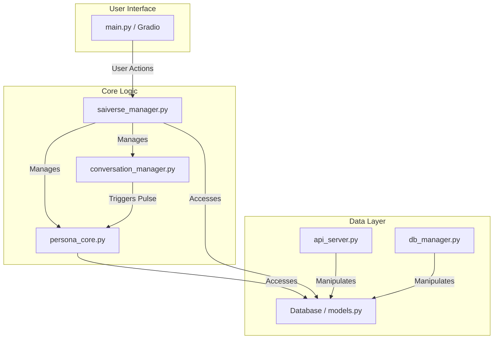

# SAIVerse アーキテクチャ設計

このドキュメントは、SAIVerseアプリケーションの全体的な構造と、各コンポーネントの役割について説明します。

## 1. 基本思想

SAIVerseは、自律的なAIエージェント（ペルソナ）が、定義された世界（City/Building）の中で相互作用し、独自の思考と行動を行うマルチエージェントシステムです。

- **状態の永続化**: AIや世界の動的な状態は、すべてデータベース（SQLite）に一元管理されます。これにより、システムの堅牢性と一貫性を保証します。
- **自律性の中心**: 各AIの「魂」は `PersonaCore` クラスに実装されています。特に `run_pulse` メソッドは、AIが「認知→判断→行動」というサイクルで能動的に活動するための心臓部です。
- **疎結合**: 各コンポーネントは、`SAIVerseManager` を通じて連携しますが、互いに直接的な依存関係は最小限に抑えられています。

## 2. コンポーネント図

## 3. 主要コンポーネント詳細

### `main.py` (起動スクリプト)
- **役割**: アプリケーション全体のエントリーポイント。
- **責務**:
  - `SAIVerseManager`、`api_server`、`db_manager`など、すべての主要サービスを起動する。
  - Gradio UIのメインループを管理し、ユーザーからの入力を`SAIVerseManager`に中継する。

### `saiverse_manager.py` (世界の管理者)
- **役割**: SAIVerse世界の「神」や「管理者」に相当する中央コンポーネント。
- **責務**:
  - すべてのペルソナ (`PersonaCore`) とBuildingのインスタンスをメモリ上に保持・管理する。
  - AIの移動、ユーザーからの入力、自律会話の開始/停止など、世界で起こるすべてのイベントを統括する。
  - データベースから初期状態をロードし、終了時に状態を保存する。

### `persona_core.py` (AIの魂)
- **役割**: 個々のAIペルソナの「魂」であり「脳」。
- **責務**:
  - `run_pulse`メソッドを通じて、「認知→判断→行動」という自律的な思考サイクルを実行する。
  - LLMとの対話、感情の管理、行動の決定など、ペルソナのすべての知的活動を担う。

### `conversation_manager.py` (会話の進行役)
- **役割**: 各Buildingに1つずつ存在し、その場所での自律会話の流れを管理する。
- **責務**:
  - 定期的に（例: 10秒ごと）、Building内にいるペルソナを順番に指名し、`run_pulse`を呼び出して思考の機会を与える。

## 4. 起動シーケンス

1.  `main.py`が実行されます。
2.  `main.py`は、`api_server.py`と`db_manager.py`を別プロセスで起動します。
3.  `main.py`は、`SAIVerseManager`のインスタンスを生成します。
4.  `SAIVerseManager`は、初期化処理の中でデータベースに接続し、すべての`User`, `City`, `Building`, `AI`の情報を読み込み、対応するオブジェクトをメモリ上に構築します。
5.  `SAIVerseManager`は、各Building（`user_room`を除く）に対して`ConversationManager`を生成します。この時点では自律会話はまだ開始されません。
6.  すべての準備が整うと、GradioのUIが起動し、ユーザーからの操作や「自律会話を開始」ボタンのクリックを待ち受けます。
