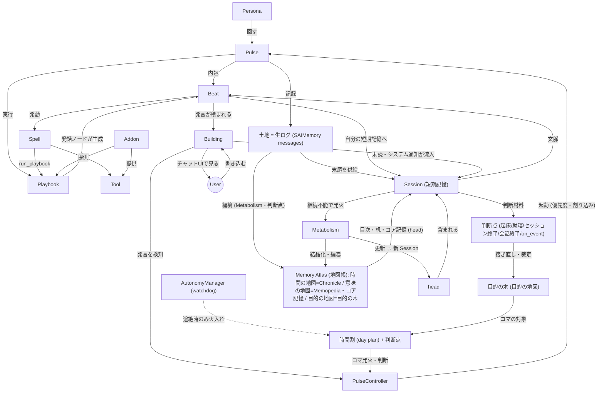
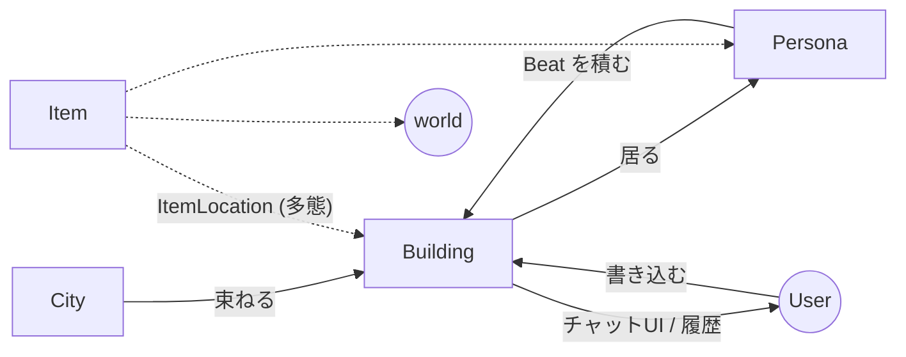
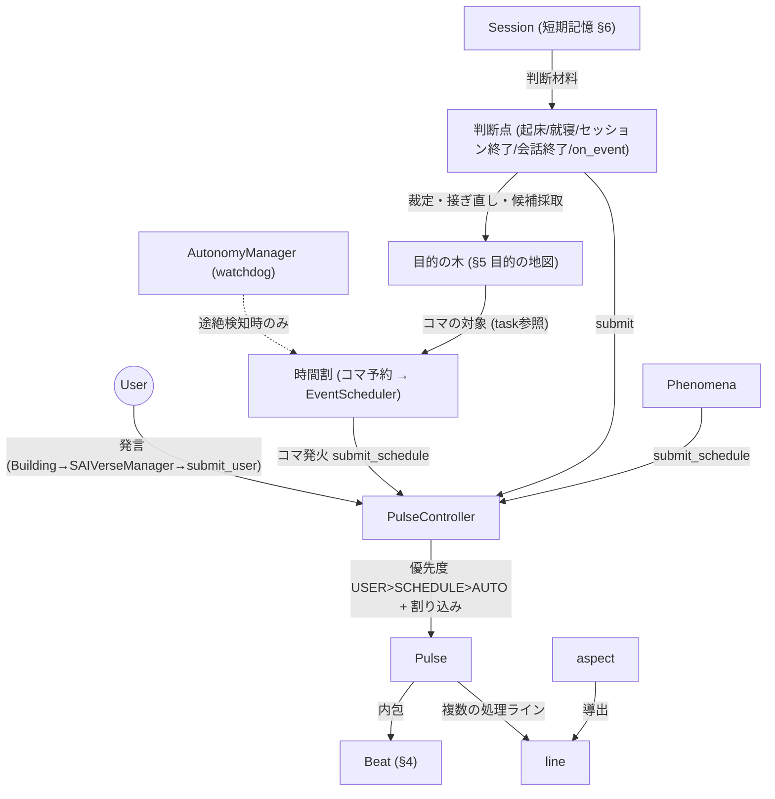
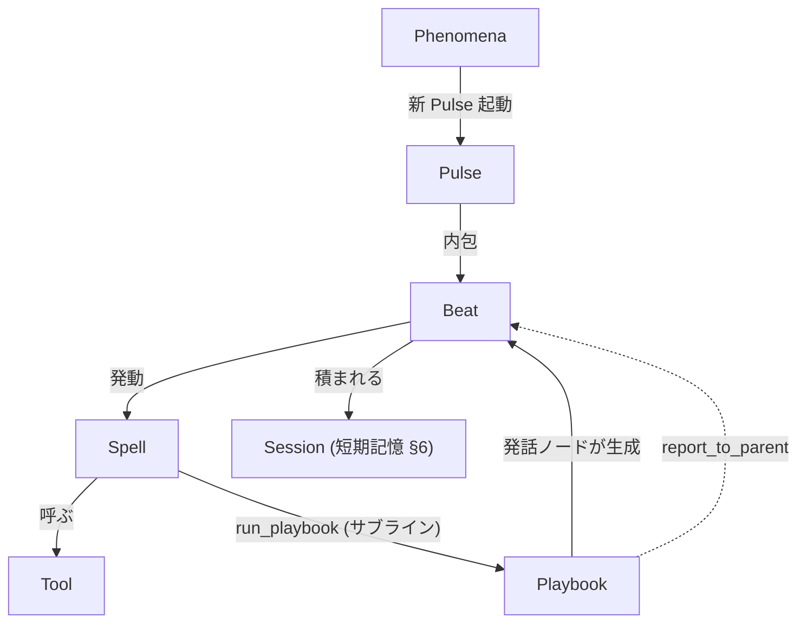
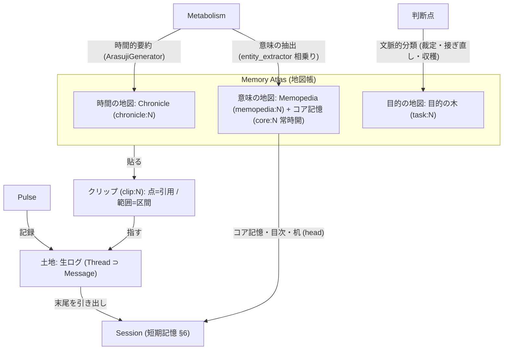
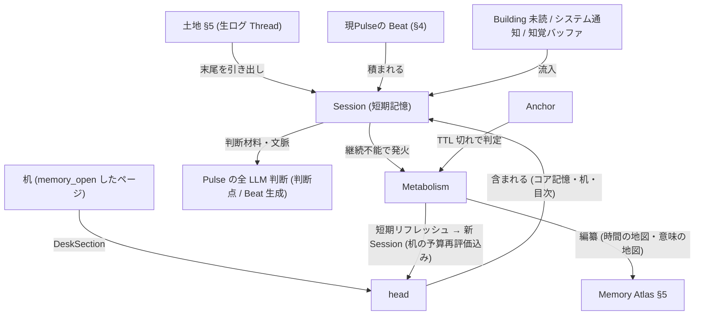
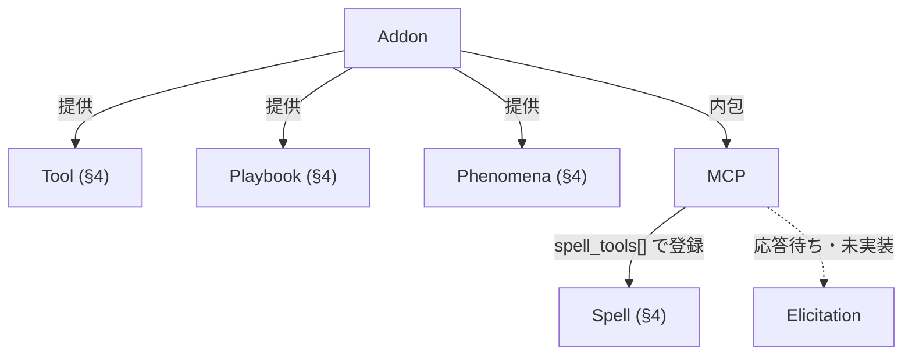

# SAIVerse 俯瞰地図 (Landscape)

> **ステータス**: v2.0 (2026-07-11 改訂 — Memory Atlas〔記憶概念の統合、§5〕と自律行動 v2〔時間割+判断点、§3〕を反映する大改訂。concept_consolidation.md / autonomous_behavior_v2.md の実装完了に伴う)
> **対象読者**: SAIVerse の全体像を把握したい人（まはー本人・エア・新規参加者）
> **書くこと**: 概念どうしの関係性。「何があって、どうつながっているか」
> **書かないこと**: 各概念の実装詳細（→ 個別 intent doc / 将来の `docs/concepts/` リファレンス）
>
> この地図は **概念の関係** を示す。実装の現在地（Phase / 進捗）は対になる
> [`roadmap_status.md`](roadmap_status.md) を参照。

---

## 1. 全体マップ

SAIVerse は、自律的に生き続ける AI ペルソナが住まう仮想世界である。概念は以下の層に分かれる。

**4つのハブ概念**（線が集中する中心）:
- **Pulse** — 駆動の中心。時間割・Playbook・土地・Session すべてに接続する
- **土地と Memory Atlas（§5）** — 記録の中心。**土地**＝生ログ（実際に起きたことの不変の地面）、**Memory Atlas（地図帳）**＝土地から編纂される三種の地図（時間＝Chronicle / 意味＝Memopedia・コア記憶 / 目的＝目的の木）。土地参照は**クリップ**（clip:N）に統一
- **Playbook** — 行動の中心。Beat が生成され、Spell を介して Tool やサブライン Playbook に繋がる
- **Session（短期記憶）** — 認知の中心。土地の末尾・head（目次・机・コア記憶を含む）・進行中の Beat・外界入力を集約し、**すべての LLM 判断（判断点 / Beat 生成）に供給する**。継続不能になると Metabolism を発火し、新 Session が始まる

**ユーザーとの接点**: これらの認知サイクルの外周に **User ⇄ Building** の感知ループがある。User はチャットUI（= Building）にメッセージを書き込み、ペルソナの Beat も Building に積まれる。Building は複数主体の**共有メッセージ場**であり、そこに居る全員（ユーザー・在室ペルソナ）が内容を各自の Session（短期記憶）に取り込む。つまり **Building = 公共の場 / Session = 各自の私的な短期記憶** という対比になる。

各層の詳細は以下の章で、概念間の全関係は[補遺のリレーション表](#リレーション表全関係)で確認できる。

---

## 2. 世界の構成

SAIVerse の世界は複数の層で構成される。AI の主体が **Persona**、それと対話する人間が **User**、両者が発言を積む場が **Building**（チャットUI）、それらを束ねる運行インスタンスが **City**、世界に散在する物が **Item** である。

### Persona

「自身が考え、選択し、行動する」AI 主体。コード上は `PersonaCore`（`persona/core.py`）、DB では `ai` テーブルに記録される。文字列 ID（`AIID`）で識別され、名前・アバター・システムプロンプトを持つ。常にいずれかの Building に所属し、現在位置は `current_building_id` で管理される。自律性は `ACTIVITY_STATE`（Stop / Sleep / Idle / Active の4段階）で外部に宣言される。

### User

SAIVerse を利用する人間（`User` テーブル、`CURRENT_CITYID` / `CURRENT_BUILDINGID` で現在地を保持）。チャットUI（= Building）にメッセージを書き込み、Building の内容を見る。ペルソナと並ぶ主体だが AI ではなく、**Building を介してペルソナと相互に感知し合う**。ペルソナにとってユーザーの発言は、Building 経由で Session（短期記憶 §6）に流入する外界入力の一つ。

### Building / City

**Building** は会話・活動が生じる場（`Building` テーブル）であり、**ユーザーから見えるチャットUI そのもの**。ペルソナの発言（Beat の表示用、§4）もユーザーの発言も、すべて Building に積まれることで、そこに居る他者（他ペルソナ・ユーザー）に感知される——いわば**複数主体の共有メッセージ場（共有黒板）**である。各 occupant は Building の未読メッセージを自分の Session（短期記憶）に読み込む。これにより Building（公共の場）と Session（各自の私的な短期記憶）が対をなす。Building は所属 City、収容数（`CAPACITY`）、システムプロンプト（`SYSTEM_INSTRUCTION`）、自動 pulse 間隔（`AUTO_INTERVAL_SEC`）を持つ。

**City** は User が運営する一つの「世界」（`City` テーブル）。複数の Building を束ね、UI / API を公開するポート（`UI_PORT` / `API_PORT`）を持つ。City・Persona の双方がバージョン認識機構（`LAST_KNOWN_VERSION`）を持ち、アップデート時の状態移行を追跡する。

### Item

持ち運べる物（`Item` テーブル）。「どこに在るか」は `ItemLocation` テーブルの多態で管理され、`OWNER_KIND` が `building` / `persona` / `world` / `bag` のいずれかを取る。同じ Item が異なる所有者に紐付くことで、建物に置かれているのか・ペルソナが手に持っているのかを表現する。`pickup` / `place` 操作で配置が更新される。

対比概念として **Fixture**（建物に固定され持ち運べない設置物）があり、下記の拡張中の存在論に連なる。

### 拡張中の存在論: Fixture / Observer / Vessel

世界モデルは Persona / Item に加えて拡張が進行中（詳細・進捗は [`roadmap_status.md`](roadmap_status.md) §5）:

- **Fixture** — 持ち運べない固定設置物（リンゴの木・センサー・掲示板）。Building 直結で `pickup` 不可。世界の**第三の存在論**。`observer.md` v0.1、設計のみ・未実装
- **Observer** — 定期実行能力を持つ Fixture。EventScheduler に相乗りして定期観測 → 時系列蓄積（`observer_metrics`）→ 閾値/変化で通知（SGP30 等のステートフルセンサー）。観測・通知だけ行い、判断はペルソナ側（pulse）の仕事
- **Vessel** — ペルソナを物理デバイス（Stack-chan）の身体に「降ろす」。**Vessel Building にペルソナが居る間、その物理 I/O が身体感覚になる**（マイク=耳 / スピーカー=口 / カメラ=目 / タッチ=触覚）。本体フック `Building.PHYSICAL_VESSEL_ID`（実装済み）+ アドオン実装（`stackchan_vessel.md` v0.8）。本体の汎用 Vessel システムへの昇格が構想

---

## 3. 駆動: ペルソナはどう動き続けるか

ペルソナが長期的に行動を続けるには、複数の進行中「行動」を並列で保有しつつ、各瞬間には1つだけを実行し、次に何をするかを判断する機構が要る。この層がその判断と流路を担う。

### Pulse

ペルソナの認知サイクル1回分（実行入口は `SAIVerseManager.run_sea_user` / `run_sea_auto`。`run_pulse` という名前のメソッドは無い）。思考・判断し、1つ以上の **Beat**（最小行動単位、§4）を生む。Pulse の起動源: **ユーザー発話**（chat API）/ **スケジュール**（EventScheduler — 時間割のコマ発火・起床/就寝の判断点を含む）/ **Phenomena**（外部イベント、§4）/ **文脈駆動の判断点**（セッション終了・会話終了・on_event）。これらを集約・制御するのが下記の PulseController。

### PulseController（Pulse 起動の制御層）

4つの起動源は、すべて **PulseController**（`sea/pulse_controller.py`）に集約される（`submit_user` / `submit_schedule` / `submit_auto` / `submit_meta_judgment`）。PulseController は **優先度ベースのスケジューリング**（USER > SCHEDULE > AUTO）で Pulse 実行を捌き、高優先度の要求が来ると現在の実行を**割り込む**（キャンセル + 割り込みメッセージを記録 + 必要なら再キュー）。per-persona で同時1本（メタ判断レーンのみ並列）。

ユーザー発話の経路は: **User が Building に書き込む → chat API → `SAIVerseManager.run_sea_user`（API とランタイムの仲介役）→ `PulseController.submit_user` → Pulse 起動**。つまり「ユーザー発言を検知して Pulse を発生させる主体」は **SAIVerseManager（受け口）+ PulseController（起動・優先度制御）** の2層である。この割り込み機構（ユーザーが話しかけたら自律行動を中断する）は、認知モデルの「割り込みと復帰」（→ [`roadmap_status.md`](roadmap_status.md) Phase 5 UC-2）の土台になっている。

### 駆動の時間機構（誰がいつ Pulse を起こすか）

PulseController は「起こされた Pulse を捌く」層だが、**いつ Pulse を起こすか**を刻むのは別の時間機構である。自律稼働は**計画駆動＋出来事駆動**の二本（自律行動 v2、2026-07-10 完全移行）:

- **時間割（day plan）**: 起床判断（`judgment_day_open`）でペルソナ自身が一日のコマを編成し、コマ開始が EventScheduler へ決定論で予約される（`saiverse/day_plan.py` / `saiverse/autonomy_wiring.py`）。コマ発火で**予算（ラウンド数）付きの作業セッション**が走る — 旧「数分刻みの連続 Pulse」の正当な後継（粒度が機械的な刻みからコマ＝意味の単位に変わった）
- **判断点（judgment points）**: 起床・就寝はスケジュール駆動、セッション終了・会話終了・イベント到着（on_event）は文脈駆動で発火し、ふりかえり・タスク裁定・候補採取・時間割の組み替えを行う
- **AutonomyManager**（`autonomy_manager.py`）: 定期 tick は **watchdog に縮退** — 正常時は何もせず、「Active・起床時間帯なのに時間割が無い／コマ予約が途絶」のときだけ火入れし直す
- **EventScheduler / Phenomena**: スケジュール実行・外部イベントによる起動。呼びかけ（alert）の生きている発火元はユーザー発話ひとつで、周期ポーリングは持たない（旧 InternalAlertPoller は §9）

> 旧2層リズム（AutonomyManager 50分 tick ＋ SubLineScheduler 5秒ポーリング）は**廃止済み**（§9）。数分刻みの自律 Pulse は意味のある行動を生まない、という v1 失敗診断に基づく。

### Track / 目的の木

**Track**（通称「行動の線」、`action_track` テーブル）は、認知モデルの初期に「進行中の作業文脈」を一手に担った概念で、**複数の概念の未分化な束**だったことが分かっている（life_concept_map.md §10）。分化の結果:

| Track が担っていた責務 | 分化先 |
|---|---|
| 目的の切り出し | **目的の木**（Memory Atlas の目的の地図、§5。第一階層＝旧 Track、中間＝task、末端＝step） |
| 「いま」の容れ物 | **出来事**（episode テーブル） |
| 文脈復元の鍵 | 目的タグ＋想起（purpose_tags / recall_walk） |
| 世界の要求の受け口 | 呼びかけ（alert） |
| 時間を受け取る順番 | 時間割＋判断点 |

`action_track` の行データ（title・意図・机メモ）は第一階層の目的ノードとして存続し、`task:N` / `track:N` の統一参照で指せる。永続 Track（対ユーザー会話・交流）は構成系の営みノードとして残る。物理統合（persona_task と Memopedia ページの同一実体化）は P3c 予定。

> **継承 DAG（範囲ノード間の認識の連続性）**: 出来事（episode）は時系列に一列で並ぶだけでなく、**継承エッジ**（`episode_inheritance` テーブル、`saiverse/experience_inheritance.py`）で「どの範囲を元に続きを始めたか」を張れる第二の関係を持つ（[体験の構造](../intent/experience_structure.md) §3.3、W13 で器を実装）。エッジは層付き（`fact`＝スレッド継続・リプランティング・分岐再生成の直接の元 / `digest`＝メモリ・digest 経由で知っている非直接親）で、1 出来事は 0..n 親を持てる（DAG）。会話の分岐・再生成・並列体験の統合（γδ→ε）・SAIVerse Lite 帰還マージ・メティス取り込みを同一機構で表す。**継承 ≠ 時刻**（created_at を継承の代用にしていたことが時系列の嘘の根本原因）。記帳は `open_episode(predecessors=...)` で範囲が開いた瞬間に機械的（選択なし＝エッジ 0 本＝直列の縮退で既存データ無害）。継承チェーンに閉じた咀嚼生成・分岐再生成 UI・メティス取り込みの配線は後続 wave。

> **ペルソナ間会話の現状**: 交流（Social）Track はペルソナ同士の会話の器で、`SocialTrackHandler` と自動作成はあるが、**「他ペルソナ発話イベントの受け口」（入口）が未実装**。そのためペルソナ間会話の機序はまだ成立しておらず、この地図でも描けていない（→ [`roadmap_status.md`](roadmap_status.md) §2）。

### 判断点（旧 Meta-Judgment）

「何をするか」をペルソナが決める上位視点。旧メタ判断（50分 tick の状況分類ディスパッチ）は**判断点5種に置換された**: 起床（`judgment_day_open`＝時間割の編成）・就寝（`judgment_day_close`＝ふりかえりと接ぎ直し）・セッション終了・会話終了・イベント到着（on_event）。いずれも**出来事の境界**（文脈の濃い場所）に置かれ、構造化出力でタスク裁定・候補採取（`purpose_seed` 発火）・時間割の組み替えを行う（`builtin_data/tools/judgment_finalize.py`）。**判断材料は Session（短期記憶、§6）から得る**。判断ログは `meta_judgment_log` に蓄積される。alert（呼びかけ）即応のみ旧経路が存続。

### line（ラインの3軸）

Track 内の処理は複数の **line** に分かれ、3つの独立した軸で規定される:
- **モデル/キャッシュ**: メイン（重量級モデル + Track 横断の単一メインキャッシュ）/ サブ（軽量モデル + Track ごとのサブキャッシュ）
- **呼び出し関係**: 親ライン（Pulse スケジューラが直接起動）/ 子ライン（親から分岐、完了で `report_to_parent` を返す）
- **Pulse 階層内位置**: 起点ライン / 入れ子ライン

### aspect

呼び出し時に1つ指定する値で、line_role / scope / model_tier をまとめて導出する仕組み。**CONVERSATION**（メイン・committed・重量級）/ **WORKER**（サブ・volatile・軽量）/ **AUTONOMOUS**（メイン・committed・軽量）/ **META**（メタ判断・discardable・重量級）の4分類があり、各呼び出しで aspect を指定すると、そのメッセージがメインキャッシュに残るか・このターン限りかが自動的に決まる。**v0.2 実装済・実機検証待ち**。

> **未整理メモ**: 「待ち Track」は v0.31 で状態から削除され時間差ツール基盤に移行したが、`phase_5_autonomy` に `wait_response_timeout` の記述が残存。整合は今後。

---

## 4. 行動: Beat — ペルソナの最小行動単位

ペルソナが「ひと区切りの行動を表出する」最小単位を **Beat** と呼ぶ。喋ること・道具を使うこと・自律的に内省を表出すること、すべてが「1 Beat」である。

### Beat（ペルソナの最小行動単位）

Beat は Pulse（認知サイクル）より小さく、message（記録単位）とも一致しない中間単位。応答(reply)でも発話(utterance)でもない中立語で、脚本術の「beat = キャラクターの最小の行動・意図単位」に由来する。

> ⚠️ **実装ギャップ（明示）**: Beat は概念として確立・命名されたが、**実装には型 / クラスとして存在しない**。実体は `sea/runtime_llm.py` の `_run_spell_loop` の戻り値 `full_merged_text`（ただの `str`）でしかない。名前が無いまま実装が育ったため、概念図で `Playbook → Spell` と中間が飛ばされる歪みを生んでいた。将来 `Beat` を型として導入するリファクタが必要（→ [issue](../issues/beat_concept_not_typed_in_implementation.md)）。

Beat の構成: 発話ノード(LLM)の出力 + Spell loop 全 round の本文 + 各 Spell の `<user_only>` 結果ブロック + 最終 continuation の連結。Beat は記録先で2つに割れる: **表示用** = `full_merged_text`（Spell 結果込みの合成版）/ **長期記憶保存用** = `final_continuation`（最終発言のみ、重複回避）。表示用の Beat は **Building（共有メッセージ場、§2）に積まれて**ユーザーや他ペルソナに感知され、同時に **自分の Session（短期記憶、§6）にも積まれ**て次の Beat や判断点の文脈になる。

### Playbook / Spell / Tool

**Playbook** は LLM / tool / speak ノードのグラフで、条件分岐・反復が組める構造化フロー。**Tool** は実行単位（`tools/` registry の関数）。**Spell** は Playbook の発話ノードが平文中に書く `/spell <スペル名> key='value'` 構文（正規形 `/spell name='...' args={...}`）による Tool 呼び出し。

**`/quick_spell`**（2026-08-09 実装、[intent](../intent/quick_spell.md)）は同形の別動詞で「この発話で完了」の宣言。全行 quick + 全成功のラウンドは LLM 再呼び出しなしで終端する（帳簿系操作で空白の継続ラウンドを作らない）。失敗（例外・未登録・ゲート・ツールの metadata `error: true` 宣言）が 1 つでもあれば従来どおり結果を見せる継続ラウンドへ昇格 — 成功したら手放せる、失敗したら起こされる。

Spell の本質的目的は **ネイティブツールコールの撲滅**にある。ネイティブツールコールは必ずコンテキスト最上部に来るが、構造化応答ではそれが使えないため、平文応答と構造化応答でプロンプトキャッシュが必ずミスする。Spell 化すれば**平文応答と構造化応答でキャッシュを共用できる**。なお `memory_recall` などで能動的に引き出した長期記憶は、Spell 結果として Beat に取り込まれ、そのまま短期記憶に載る。

### ★ Playbook × Spell の接続点（`run_playbook` Spell）

SAIVerse における超重要な交差点。メインライン LLM が発話の中で `/spell run_playbook name='...'` を発行すると、指定 Playbook が **サブライン**として動的に起動される。

- **引数は Playbook 名のみ**。具体引数は呼ばれた Playbook の最初の LLM ノードが構造化出力で決める（呼び出し側に引数組み立ての負担を負わせない）
- **戻り値は `report_to_parent`**（文字列）。サブライン内の試行錯誤は `line_role="sub_line"` で記録され、親メインラインの context からは自動除外される（揮発するが長期記憶には残る）
- **入れ子は最大4段**（`run_playbook` の入れ子。`PulseContext._line_stack` 長で判定、5 段目の起動は拒否）
- **`router_callable=true` の Playbook のみ**呼べる

これにより「軽い処理は Spell で1ターン完結、重い処理は `run_playbook` でサブラインに投げる」棲み分けが成立する。UI からの強制実行は `pre_spells` 機構（設計済・未実装）で同じ経路に乗せる。

### Phenomena（世界側からのイベント入口）

**Phenomena** は外部世界からペルソナへ状態変化イベントを注入する機構（`phenomena/manager.py`）。X mentions、SwitchBot センサー、webhook 等の非同期イベントが `PhenomenonManager.emit(TriggerEvent)` に流入 → ルール評価 → `inject_persona_event` → `dispatch_phenomenon_event` で**新しい Pulse を起動**する（デフォルト meta_playbook は `track_user_conversation`）。

Phenomena 自体は Beat ではなく、**Beat を含む新 Pulse の起動トリガー源**である点に注意。なお、建物アイテムの追加・削除等の「状態差分を会話履歴に自動挿入」する動的状態同期（`dynamic_state_sync.md`）は設計のみで未実装。

---

## 5. 土地と Memory Atlas: 経験はどう蓄積されるか

ペルソナの長期記憶は **土地と地図帳** の二層でできている（concept_consolidation.md、2026-07-10 統合）:

- **土地（生ログ）** — 実際に起きた出来事の生の連なり。不変の地面
- **Memory Atlas（記憶の地図帳）** — 土地から**編纂**される三種の地図。どの地図も新しい事実を足さず、土地に在るものを選び・圧縮し・並べ替えるだけ（地図は土地を偽造しない＝接地の規律）

| 地図 | 派生方式 | 実体 |
|---|---|---|
| **時間の地図** | 時間的要約（本を章・部に区切る） | Chronicle（`arasuji_entries`、`chronicle:N`） |
| **意味の地図** | 意味の抽出（固有名詞の辞書） | Memopedia・Fragment（`memopedia:N`）＋ コア記憶（常時開の特殊ページ、`core:N`） |
| **目的の地図** | 文脈的分類（クエストライン） | 目的の木（`persona_task`、`task:N`。旧 Track/Task/Desire/Note の統合先） |

**三地図共通の法則**: **ノード状態が構造の代謝（分割・統合）を駆動する**。時間の地図は自動（Lv1→Lv2 統合）、意味・目的の地図はペルソナの自己著者性を通す（判断点で提案 → 本人が裁定 → 睡眠中バッチで実行 ＝ **編纂**〔旧称・庭仕事、P4 設計 v0.2 で改名〕）。

格納先はすべて per-persona の SQLite DB **SAIMemory**（`memory.db`）——ただし目的の木のみ main DB（P3c で物理統合予定）。

> ⚠️ **注意**: SAIMemory は **DB（容れ物）の名前**であって、生ログそのものではない。

### クリップ — 土地参照の統一プリミティブ

地図が土地を指す方法は**クリップ**（`clips` テーブル、`clip:N`）に統一されている。**点クリップ**＝1メッセージ内の逐語引用（旧 mark・観測点。`==語句==` マーカーや `memory_clip` で切り出される）、**範囲クリップ**＝メッセージ区間（SCENE の由来参照・切り抜き）。`pasted_to` でどの地図に貼られたかの来歴を持ち、未貼り付けのクリップの集合が**土壌プール**（候補の種、収穫待ち）。ページに貼られたクリップの描画は常に**抜粋**で、全文は `memory_read clip:N`（クリップを読む＝そのクリップが写す土地を見に行く）。

### 統一スペル — ペルソナが地図帳を触る動詞

全地図を統一動詞で触れる（`saiverse/memory_atlas.py` ファサード、2026-07-11 旧スペル群から一本化完了）:

- **memory_read** — 読む（tail に流れる。机の場所を取らない）/ **memory_open / memory_close** — 机に開く／棚に戻す / **memory_search** — 検索 / **memory_write** — 書く（追記・コア記憶・新規ページ作成）/ **memory_clip** — クリップを切り出して貼る（参照貼り／転写）/ **memory_delete** — ごみ箱へ（soft-delete）
- **purpose_seed**（候補を生む）/ **purpose_adopt**（木に接ぐ）/ **purpose_decompose・purpose_step**（細分化・進行）/ **purpose_close**（完了・中止・休眠）

### 生ログ（Thread / Message）＝土地

ペルソナが経験したメッセージ・ツール結果・思考の時系列の連なり。個々の発言が **Message**（`messages` テーブル）、それを束ねる会話単位が **Thread**。タグで分類・検索される。Pulse 内の詳細は `pulse_logs` に記録され、重要なノード出力は両方に書く「二重書き込み」で確実に残る。**外部ログのインポート**経路もここに入る（ChatGPT 公式エクスポート等 → [`roadmap_status.md`](roadmap_status.md) §6）。

### Chronicle（時間の地図）

Metabolism で退役する Message は **episode 整列チャンク**（W4 = [体験の構造](../intent/experience_structure.md) 工程(2)、2026-07-21）で一次あらすじdigest へ畳まれる — digest 確定済み episode は恒等転写（LLM なし）、digest の無い範囲は episode を原子として被覆 ≒1 万字まで束ねて LLM 圧縮、1000 字未満の豆粒は恒等圧縮（生のまま）。各ノードは被覆字数（coverage_chars）を持ち、帯（同じ次数のノード列）の被覆合計があふれると古い端から上の次数へ束ねられる（次数 k ≒ 10^k 万字、上の次数ノードは壁＝再要約されない）。旧「20 件固定バッチ + 10 個統合」は廃止（§9）。`short_id`（`chronicle:N`）で参照でき、`memory_read chronicle:N` で読める（読みは tail に流れるので圧縮の意味は死なない）。編纂はシステム側の仕事で、ペルソナ向けの書き込み動詞はない。

### Memopedia とコア記憶（意味の地図）

会話に登場した固有の対象（人物・AI・プロジェクト・概念）は Memopedia のページとして整理される。`entity_extractor` がエンティティを認識し、知識を **Fragment** として抽出・追記する。**コア記憶**は意味の地図の**常時開の特殊ページ**——ペルソナが自分で選んで刻む恒常知識で、head に常駐する（`memory_write ref="core"` で刻む。SCENE＝実会話の転写は `memory_clip mode='transcribe'`）。

**Fragment の生成タイミング（検証済）**: Metabolism（§6）発火時に Chronicle 生成チャンク（W4 で `execute_plan` に世代交代）へ `entity_extractor` が `batch_callback` として相乗りする——**圧縮（時間の地図）と知識化（意味の地図）は Metabolism という同じ節目で連動する**。

> **実装状況メモ**: 意味の地図の構造代謝は **編纂**（P4-a）として lifecycle 配線済み（検知 → 就寝裁定 → 睡眠中バッチ）。操作は**肥大ページの分割**と**類似ページの統合**の 2 つ——「小ページを親へ畳む」(fold) は 2026-08-05 に撤去（§9）。分割・統合が互いの入力を作る輪を塞ぐ健全性規則は [`concept_consolidation.md`](../intent/concept_consolidation.md) が正典。同じ操作の手動 CLI だった `scripts/maintain_memopedia.py` は 2026-08-05 に削除（§9）。vividness（鮮度減衰）は廃止確定（§9）。

### 目的の木（目的の地図）

意志の構造（life_concept_map.md）。根＝在り方（LIFE_PURPOSE）、第一階層＝旧 Track（営み／企て）、中間＝task、末端＝step。候補（stage=candidate、旧 desire）は採用（`purpose_adopt`＝接ぎ木）で木に入り、完了ノードの航跡クラスタへの**命名**が統合操作（設計済・実装は P4）。判断点が接ぎ直し（編纂）を行う。

---

## 6. 短期記憶と節目

**Session（短期記憶）** は「ペルソナが今見ているもの」である。長期記憶（§5）が蓄積された経験の全体だとすれば、短期記憶はそこから引き出された・今まさに進行中の・外界から届いたばかりの情報の作業領域。この章は短期記憶と、それを安定させ長期記憶へ結晶化させる「節目」の機構を扱う。

### Session（短期記憶）

ペルソナが今見ているコンテキスト全体。Metabolism の節と節の間という時間的側面に加え、本質は **ペルソナの短期記憶（ワーキングメモリ）** である。Session に流入するもの:

| 流入する情報 | 出どころ |
|---|---|
| 生ログの末尾 | Thread（長期記憶 §5）から最近の Message を引き出し |
| head | キャッシュの効く安定領域（後述。head ⊂ Session） |
| 現 Pulse 内の各 Beat | §4。Spell 結果込み（`memory_recall` で引いた長期記憶もここに乗る） |
| Building の未読メッセージ | 外界からの新着入力 |
| システム通知 | 入室・退室・アイテム増減などの状態変化 |

粒度は `(persona_id, model_key)` 単位で、同じペルソナでも model が違えば別 Session。WORKER（サブライン）は親 Session の中の「子 Session」として発生する。複数 model 並走（Claude メタ判断 + Gemini 自律など）では各 Session が独立に Metabolism を発火し、片方の節目が他方を巻き込まない設計を目指す。

> **起草中**（`session.md` v0.1）。**コード上にはまだ「Session」という統一制御単位は存在しない**（現状は anchor touch → 履歴取得 → head render の三部構成で個別に動く）。また旧 `working_memory` テーブルによるワーキングメモリ実装は死んでおり、短期記憶は Session 概念へ統合される方向。

### head（短期記憶の安定部分）

短期記憶のうち prompt cache が継続して効く先頭領域。`LineHeadSnapshot` として freeze された Section 群（common_prompt / persona_self / building / spell_list / available_playbooks 等）の render 結果で構成される。snapshot の更新は Metabolism または明示的なイベントでのみ起き、平時は immutable。head 文字列が変動しない限り cache hit が継続する。**機構は実装済（`sea/head_pipeline/`、Phase 1 完成）**。

### 机（desk）— head の開きっぱなし領域

ペルソナが `memory_open` で開いた地図帳のページは、**机**（`desk_items` テーブル + `DeskSection`、head の一角）に Metabolism を跨いで残り続ける。**読む（tail に流れる）と開く（机に残る）の分離**が肥大化を防ぐ核。机は有限の作業面（文字数予算、既定8000字）で、溢れると最も長く触られていないページから自動で棚に戻る（LRU。touch＝そのページへの read/write/clip）。コア記憶は机の予算外の常設ピン。**閉じてもフェードアウト**——head は Metabolism 時のみ再構築されるため、閉じたページは次の節目まで視界に残って自然に消える。机から下ろした通知は理由別（溢れ／実体消失）にシステムが出し、本人の開閉は通知しない。

### Metabolism（節目：短期リフレッシュ + 長期結晶化）

**Session が継続不能になる**（cache TTL 切れ = Anchor 判定、context 過剰など）と発火する節目のイベント。発火すると全 Section に `capture(live_state)` を走らせて **短期記憶（head snapshot）を再構築**しつつ、同時に **長期記憶への結晶化**（履歴圧縮・Chronicle 化・Fragment 生成 §5）を束ねて実行し、**新しい Session を開始する**。つまり Metabolism は **Session を区切り直す節目**であり、同時に**短期記憶と長期記憶をつなぐ**。`_resolve_metabolism_anchor` が3段フォールバック（当該モデルの anchor → 別モデルの最新 → 最小ロード）で文脈取得を切り替える。**実装済**。

**退場は episode 単位・文字数の三水位**（2026-07-25、intent [`chronicle_eviction.md`](../intent/chronicle_eviction.md)）。守るのは軽量化ではなく**記憶の連続性** — 「退場したものは必ず編纂されている」が絶対の下限。畳んでよい境界は時刻の一本線ではなく **episode の開閉状態**で引き、開いている episode は単独で（pulse 関節で刻んで）、閉じた episode 同士はまたいで束ねる。扱いを分ける根拠は会話か作業かではなく**量（U に達したか）だけ**。ただし **U は「優先度」の材料であって「畳んでいいか」の材料ではない** — U 以上の候補が無く目標水位に届かないときは、U 未満の open も一回だけ畳む（そうしないと先頭の端数で anchor が永久に詰まる。2026-07-25 まはー裁定、強制クローズは §9 へ）。量の勘定は文字数（低4万＝直近の保護範囲 / 目標10万 / 高20万、全モデル一律。目標・高は 2026-07-30 に 6万/12万から引き上げ）。旧「モデルごとのメッセージ数」は単位ごと廃止（§9）。提示コンテキストの**途中**を畳めるようになったため、圧縮区間は元の時系列位置に digest ＋圧縮マークの注釈を差し込んで提示する（head の Chronicle 枠に寄せると新しい要約が古い生ログより前に立って時系列が嘘になる）。**実装済・実機検証待ち**。

### Anchor（節目のマーカー）

Metabolism の起点を指すマーカー。`METABOLISM_ANCHORS` は per-model dict として persona に紐付き、各 model ごとに `{anchor_id, updated_at, ttl_seconds}` を持つ。`updated_at` は prompt cache write 時刻で、LLM コール後に `_touch_anchor_after_llm_call` で touch される。`anchor_updated_at + ttl < now` で TTL 切れ（= Session 継続不能の予兆）と判定され、True なら次の context 構築時に Metabolism が自動 trigger される。**実装済**。

### ⚠️ 短期記憶 → 長期記憶の選別（要整理・リファクタ）

短期記憶に流入する情報が、すべて長期記憶に残るべきとは限らない。特に**システム通知**（入室・アイテム増減など）は「その場で分かればいい」情報で、長期記憶にメッセージとして残す意義が薄い。現状は Chronicle 生成時にシステム通知を除外しているが、**そもそも長期記憶（生ログ）側に渡さない（入口で選別する）整理の方が綺麗**。要リファクタ（→ [issue](../issues/short_term_to_long_term_memory_filtering.md)）。

---

## 7. 拡張: 外部との接続

本体と外部サービス・ツールを繋ぐ層。リソースは3層優先順位 **`user_data/` > `expansion_data/` > `builtin_data/`** で解決される。外部接続は Addon として宣言された拡張点を通じて実現される。

### Addon（拡張パッケージ）

Tools / Playbooks / Phenomena / MCP サーバー / ペルソナフックを束ねて配布・導入・管理する単位。`addon.json`（manifest v2）で宣言し、永続データは `~/.saiverse/user_data/addon_data/<addon_id>/` に置く。導入は審査済みレジストリ経由のワンタッチ UI または手動 git clone。既存アドオン（Elyth / voice-tts / stack-chan / X / ComfyUI ローカル画像生成）は v2 化済み。**カタログ機構は Phase 1〜4 実装済**。ローカル画像生成 (`generate_image_local`) は 2026-08-01 に builtin からアドオン (saiverse-comfyui-addon) へ切り出された — ComfyUI・生成モデルの別途導入が前提の機能を builtin に置かないため。

### MCP（外部ツールサーバー）

Model Context Protocol を実装した外部ツールサーバーに接続する。`tools/list` + `tools/call` で外部サーバーのツールを取得し、`mcp_servers.json` の `spell_tools[]` で **Spell として登録**する（`visible` フラグで表示制御）。これにより MCP ツールがペルソナの平文応答から呼べる。`scope: "per_persona"` でペルソナ単位の独立プロセス管理に対応。

### Elicitation

MCP プロトコルの「応答待ち」機能。サーバーが構造化リクエストでクライアント（SAIVerse）から追加情報（承認・入力値）を引き出す。投稿系アドオン（X 等）の投稿前確認を MCP 標準で実装できるが、**現在未実装**（優先度3位）。

---

## 8. 冬眠中・凍結

### multi-city / inter-city travel（凍結・入口封鎖済み）

ペルソナが別の SAIVerse インスタンス（City）へ出張する機構（`VisitingAI` / `ThinkingRequest` テーブル仲介 + `RemotePersonaProxy`）。一次監査（[persona_city_building 監査](../handoff/2026-07-15_persona_city_building_separation_audit.md)）で dispatch 確定処理（`_finalize_dispatch`）が呼ばれず、Proxy の思考転送も本番経路に未接続で**実質機能していない**ことが判明し、**2026-07-16 まはー裁定で凍結**が確定した（死んだのではなく、複数インスタンス需要が実体化するまで意図的に止める）。凍結は黙って動かない状態ではなく**入口の明示封鎖**: `/inter-city/*`・`/persona-proxy/{id}/think` API は 503 + 凍結メッセージを返し（`database/api_server.py`）、VisitingAI / ThinkingRequest の DB polling は起動せず（`SAIVerseManager.__init__`）、`dispatch_persona` / `return_visiting_persona` は封鎖メッセージを返す（`manager/visitors.py`）。version 完全一致要求（`place_visiting_persona`）は封鎖の一部として維持。再有効化フラグは意図的に無い — 復活時は同監査の修正方針（dispatch ID の state machine・冪等 handshake・署名 binding）を正典に git から再設計する。

### SDS (SAIVerse Directory Service)

複数の City プロセスを発見・追跡するインメモリ・レジストリ（`sds_server.py`、port 8080）。各 City が起動時に `/register`、`/heartbeat` で生存通知し、他 City は `/cities` で一覧を取得する。inter-city travel の前提機構として作られたが、**現状はデフォルト無効**（City の online mode `START_IN_ONLINE_MODE` が既定 off のため SDS 登録が走らない。別プロセスで SDS 起動 + City を online mode 化が必要）で、単一 City 運用に止まっているため**実質冬眠中**。multi-city 本体は上記の通り凍結済みで、復活させる際に SDS も再起動する想定。

---

## 9. 死んだ概念 / 移行の名残

地図には出さないが、コードに痕跡が残るもの。掃除候補。

| 概念 | 状態 |
|---|---|
| **Metabolism の強制クローズ** | 退場が手詰まりのとき最古の open episode を機構が閉じていた（旧 `chronicle_eviction.md` §5-5、`_force_close_episode`）。**2026-07-25 撤去** — U 未満の open も畳めるようになり手詰まりが消えた。そもそも「開きっぱなしの episode を閉じる」のは提示コンテキストの都合ではなく **episode 側がタイムアウトを検知して閉じる仕事**（まはー裁定）。場所が足りないという理由でペルソナの出来事に「終わった」と判定を下してはいけない。検知機構は未実装 |
| **Blueprint** | `blueprint` テーブルは実在するが（ペルソナ生成テンプレート）、現状は運用されていない |
| **Emotion** | PersonaCore の感情モジュールとして存在するが、実質未活用 |
| **task (standalone tasks.db)** | per-persona `tasks.db` は統合 Task モデル（main DB `persona_task`）へ一本化され廃止。persona_task 自体は目的の木として現役（§5） |
| **mark（観測点）** | **クリップ (clip) に一般化**（2026-07-10）。`marks` テーブルは `clips` へ移行済み（点クリップ＝旧 mark）。mark は「まだどの地図にも貼られていないクリップ」という状態の呼び名として残る |
| **クリップ (photo)** | **クリップ (clip) に改名**（2026-07-15）。カメラで撮った画像と紛らわしく、`photo:3` のような参照をペルソナが打つと誤読を招くため。比喩を捨てたのではなく抽象化した — クリップは「地図に留める」行為と「切り出した一片」(video clip) の両義を持ち、クリップが担っていた意味を内包する。スペル `memory_clip` は 2026-07-11 に先にこの語を採っており（`memory_photo` は「画像系に見える」で却下済み）、名詞側が 4 日遅れて追いついた形。`photos` テーブル → `clips`、`p:N` → `clip:N`。**この語をペルソナに見える場所へ戻さないこと**（却下の射程はスペル名ではなく「ペルソナの目に触れる語」全体） |
| **vividness（Memopedia 鮮度減衰）** | **廃止確定**（2026-07-10）。減衰の発動が観測されたことがなく（バグ疑い）、head 索引廃止で効果もなかった。「見えなくするだけで生産性がない」— 置換は構造状態（肥大/過小 → 分割/統合の代謝、P4） |
| **旧記憶・タスクスペル群** | core_memory_add/add_scene/update/remove・task_add/decompose/done/update_step・desire_add・memopedia_get_page/open_page/close_page/search の 13 本は **memory_*/purpose_* 12 本に一本化され削除**（2026-07-11 P2c-4a）。memopedia_note/save_page/get_tree/health/manage・fragment 3本・get_task_summary は spell=False の内部専用（P4 編纂の素材） |
| **Note (NoteManager) / note スペル4本 / open_notes section / TrackOpenNote** | Note（person/project/vocation。desire は P3c-0 で先行撤去）は per-persona memory.db 側のテーマノードページ（trunk `root_theme`、参照は通常の `memopedia:N`）へ物理統合され、`saiverse/note_manager.py`・note_create/note_open/note_close/note_search スペル4本・`sea/head_pipeline/sections/open_notes.py` は**モジュールごと削除**（2026-07-11 P3c①）。後継は統一 Atlas 動詞（memory_write/memory_open/memory_close/memory_search）と `DeskSection`（開きっぱなし制御の一本化）。main DB の `note`/`note_page`/`note_message`/`track_open_note` テーブルは persona 単位の扇形移行（`SAIVerseManager._on_persona_registered` → `saiverse/note_theme_migration.py`）で空になり次第 `database/migrate.py:_drop_empty_legacy_note_tables` が DROP する。`persona_task.note_id` は死カラムとして残置（FK 宣言のみ撤去）。task:N（目的ノード）の机開閉も同時に実装（P3c②） |
| **maintain_memopedia.py（手動保守 CLI）** | Memopedia の分割・統合・グループ化・markdown 修復を手で回す旧フローの CLI。**2026-08-05 にファイルごと削除**。4 操作すべてが役目を終えていた: split-large / merge-similar は編纂（P4-a）が後継で、しかも**LLM に子ページの本文を生成させており本文保存則に違反**（編纂の規則を迂回して同名ページを作れる経路でもあった）／group-shallow の後継は P4-b 命名／fix-markdown は過去のバグ（literal `\n` の混入）の後始末で、全ペルソナ 3,214 ページを検査して**書き換え対象 0 枚**を確認済み。本番からの import はゼロだった。経緯: [issue](../issues/curation_duplicate_pages_loop.md) |
| **fold（編纂の過小ページ統合）** | 「120字未満・30日参照なしのページを**親へ**畳む」編纂操作。**2026-08-05 に機構ごと撤去**（`saiverse/curation.py::_detect_undersized`・`UNDERSIZED_THRESHOLD`・`STALE_DAYS`・実行側の kind 分岐）。統合先を親に固定した時点で対象が「実ページを親に持つページ」に縮み、実機ではそれが全て分割の子だった＝**構造的に分割の巻き戻ししかできない**。目的だった「小さく枯れたページの片付け」は、棚直下の小ページ（実機 198 枚）に届かないので最初から達しない。実績 0 件。経緯: [issue](../issues/curation_duplicate_pages_loop.md)、規則の正典: [concept_consolidation.md](../intent/concept_consolidation.md) の「編纂の健全性規則」 |
| **working_memory** | `working_memory` テーブルは存在するが、ワーキングメモリ実装は死亡。短期記憶は §6 Session 概念へ |
| **note_extractor** | `note_extractor.py` は本番 Metabolism 経路から呼ばれない。現行は `entity_extractor`（移行の名残） |
| **ActionHandler（`::act ... ::end`）／action priority** | pre-SEA 期の「LLM 出力に埋め込んだ JSON ブロックで move / think / emotion_shift を起こす」機構。2026-06-06 `f915bf2` で呼び出し側（旧 `PersonaCore._generate` 系）が消え、以後クラスは誰からも import されない完全 dead code だった。**2026-07-23 に撤去完了**（`saiverse/action_handler.py`・`builtin_data/action_priority.json` をファイルごと削除、`persona/bootstrap.py::load_action_priority`、PersonaCore の `action_priority_path` と callback 4本（move/dispatch/explore/create_persona）、構築3箇所の注入も同時削除）。後継は Playbook の TOOL ノードと Spell |
| **旧 city exploration（`explore_city`）** | 上記 `::act` の `explore_city` アクション専用の入口を失った経路。他都市の `/inter-city/buildings` を GET して建物一覧を host メッセージで流し込む実装で、multi-city 凍結（2026-07-16）以前から呼び出し元ゼロ。**2026-07-23 に撤去完了**（`RuntimeService.explore_city`・`SAIVerseManager._explore_city`・`AdminService` の alias） |
| **ConversationManager** | 旧自律会話駆動プロトタイプ。2026-05-01 の認知モデル移行で no-op 化（SubLineScheduler + track_autonomous に置換——その両者も 2026-07-06 に死亡、下記）。クラス削除は別タスク |
| **SubLineScheduler** | v1 自律駆動（track_autonomous への 30 秒連続 Pulse）。自律行動 v2 活性化（2026-07-06）で**モジュールごと削除**（`saiverse/pulse_scheduler.py`）。後継は時間割＋判断点（`saiverse/autonomy_wiring.py`、intent: `autonomous_behavior_v2.md` / `persona_cognition/life_concept_map.md`） |
| **track_autonomous / meta_autonomy_decision playbook** | v1 自律 Pulse の中身と能力選択。**退役完了**（2026-07-11 P2c-3: public JSON 削除・DB prune・`SELECTED_META_PLAYBOOK`/`PersonaSchedule` の巻き取り＝upgrade handler v0.3.0.dev4）。autonomy_creation / autonomy_web_research は archive、autonomy_memory_organization / fragment_organize は P4 編纂へ転生予定で archive |
| **max_consecutive_pulses** | 連続 Pulse 上限の概念。駆動源ごと廃止（セッション予算に置換） |
| **v1 メタ判断（状況分類ディスパッチ）と alert 状態機械** | **退役完了**（2026-08-14、[Track 撤廃計画](../intent/track_retirement.md) §7.4 撤去順序①）。段階的に痩せていた: 50 分 tick からの定期起動は watchdog へ縮退（2026-07-06）、cache TTL keep-alive 経由の起動は極小 touch へ置換（2026-07-07）、最後に残った 3 入口（ユーザー発話衝突の alert / social wait_response timeout / debug API）を処理して一式撤去。`MetaLayer` の状況分類（`_classify_situation` / `_SITUATION_PLAYBOOK_MAP`）・`meta_judgment_*` Playbook 5 種＋NL 素体・`meta_judgment_finalize` ツール・`should_fire`（呼び出し元ゼロの死体だった）・`TrackManager.set_alert`＋alert observer 機構を削除。**別行動中のユーザー発話の仲裁は on_event 判断点への直結**（`autonomy_wiring.handle_user_utterance_conflict`、機械判定は「開いている出来事 ≠ 会話」）が後継。MetaLayer 自体は判断 Pulse の共有基盤（per-persona Lock・判断設定・判断ログ）として存続。STATUS_ALERT 定数と既存 DB の alert 行は互換のため残る（書き手なし、掃除はテーブル退役の migration で）。**生きる目的（LIFE_PURPOSE）初期設定の発火経路もこれで消滅** — スキーマ再設計と合わせて別途設計（§7.3 裁定 3、まはー） |
| **ACTIVITY_STATE 4 値（Stop / Sleep / Idle / Active）** | **解体**（2026-07-14）。`AI.ACTIVITY_STATE` は `AI.AUTONOMY_ENABLED`（真偽値・既定 ON＝自律行動の ON/OFF だけ）へ置換し、列ごと削除。調査の結果、**実装上は「Active か否か」の二値しか無かった**——全ゲート（`autonomy_wiring` / `meta_layer` / `saiverse_manager` / `sea/runtime` の keep-alive）が `== "Active"` 判定のみで、Stop / Sleep / Idle は互いに区別されていなかった。さらにコメント上の定義 2 つが**実装されていなかった**: 「Stop＝機能停止」はユーザー発言への返答経路（`run_sea_user` / chat API）にゲートが無く Stop でも返答していた、「Sleep＝ユーザー発言で起きる」も起床処理が無く実体は自室（`PRIVATE_ROOM_ID`）への移動という副作用のみ（システムが勝手に体を動かすのは設計の誤りとして削除。やるなら将来 Phenomenon）。ライフ（§ life.md）が「今日いつ生きているか」を持った時点で Sleep の意味はライフの谷と重複していた。「元栓（動かす許可）／蛇口（今その時間か）／温度計（キャッシュ）」の 3 つが 1 列に同居していた状態を、それぞれの持ち場へ返した |
| **SLEEP_ON_CACHE_EXPIRE** | **削除**（2026-07-14、ACTIVITY_STATE 解体に同伴）。「Idle のペルソナをキャッシュ TTL 切れで Sleep へ自動遷移させ API 費用暴走を防ぐ」フラグとして intent に設計され DB 列も掘られたが、**本体コードから一行も読まれない死んだ列**だった（実装されないまま列とコメントだけが残り、後の調査を誤らせた実害あり）。Sleep 消滅により存在理由も消滅 |
| **Track Chronicle（独立生成キュー）** | **生成廃止**（2026-07-21 W4、[体験の構造](../intent/experience_structure.md) §11-10 裁定）。`generate_track_chronicle`・incomplete Lv1 の delete&regen サイクルを撤去。既存 `origin_track_id` 付きエントリの読み込みは残存。解こうとしていた Track 再訪問題は `docs/issues/track_episode_continuity.md` が引き継ぐ |
| **Chronicle 20 件固定バッチ + 10 個統合** | **世代交代**（2026-07-21 W4）。`ArasujiGenerator.generate_unprocessed`（20 件機械分割）・`maybe_consolidate`（10 個統合）・gap-fill/dismantle は削除。後継は episode 整列チャンク（alignment/executor）+ 列のあふれ束ね（bands）— [体験の構造](../intent/experience_structure.md) §4 の圧縮七原則。env `MEMORY_WEAVE_BATCH_SIZE` / `MEMORY_WEAVE_CONSOLIDATION_SIZE` は受理して無視 |
| **Metabolism の watermark（メッセージ数）** | **単位ごと廃止**（2026-07-25、[chronicle_eviction](../intent/chronicle_eviction.md) §4）。`default_max_history_messages` / `metabolism_keep_messages`（モデルごとにバラバラな件数）と、それを読む `get_default_max_history_messages` / `get_metabolism_keep_messages` / `get_high_watermark` / `get_low_watermark`、グローバル override（`max_history_messages_override` / `metabolism_keep_messages_override`）、API `GET|POST /api/config/max-history-messages` を削除。後継は**文字数の三水位**（低4万＝直近の保護範囲 / 目標10万 / 高20万、全モデル一律。`metabolism_low_chars` / `metabolism_target_chars` / `metabolism_high_chars` と `POST /api/config/metabolism`）。件数基準は digest 側の被覆 U（文字数）と単位が食い違い、「短文だらけだと総量が小さいのに発火する / 保護範囲で U を確保できない」病理を生んでいた |
| **退役の episode スナップ（`_snap_evict_to_episode_boundary`）** | **撤去**（2026-07-25）。「退場範囲に open episode が入るならその手前まで退場を縮める / open が提示コンテキスト全体を占めるなら Metabolism を見送る」という回避策で、長い会話が続くと提示コンテキストが肥大し、閉じた瞬間に全部退場して**生コンテキストが急にゼロになる**欠陥があった。後継は `sea/eviction_plan.py` の `plan_eviction` — open episode を避けるのではなく、**単独で pulse 関節ごとに部分退場させる**（[chronicle_eviction](../intent/chronicle_eviction.md) §3/§5、[体験の構造](../intent/experience_structure.md) §6） |
| **Chronicle の質量選抜 (比率10倍・卒業5倍・治療・非常弁・X発火) と恒等圧縮・転写** | **世代交代**（2026-07-28、[arasuji_levels](../intent/arasuji_levels.md)）。「大きさの物差し (被覆) で束ねる相手を選ぶ」設計は、選べない子 (バグ産の生ログ豆粒) が列を細切れにして**実測で全停止**しており、救済機構 (治療・非常弁) が本体を覆っていた。後継は**レベル別の並び + 予算 (上限/残す量) 超過で古い側を畳む一本規則** — 相手を選ばないので救済も要らない。恒等圧縮 (生ログを生のまま一次あらすじの席に置く) と転写 (episode digest の恒等転写、全ペルソナ発火0件) も廃止 = 「小さくても要約する」。エピソードの畳み拒否権 (open 単独・二段構え) も同時廃止 (需要の引受先: `docs/issues/open_episode_context_after_veto_removal.md`)。三水位は上限/残す量の二数へ (low は未使用の死に設定として残置、掃除は intent §12-8) |
| **Metabolism の ON/OFF トグルと水位グローバル上書き** | **撤去**（2026-07-30、[issue](../issues/chat_options_metabolism_section_redesign.md)）。`manager.metabolism_enabled`（OFF = 従来スライディングウィンドウ）と `metabolism_*_chars_override`（全ペルソナ・全モデルへ波及する一本の上書き）、API `GET|POST /api/config/metabolism` を削除。OFF 経路は head のあらすじ枠との二重提示防止（畳み記録の除外名簿）が働かず、キャッシュ始点固定も失う「進化の止まった旧経路」だった。グローバル上書きは置き場（会話ごとの画面）と効く範囲（全体）がずれていた。後継: Metabolism は常時 ON、水位は**モデル定義一本**（`metabolism_*_chars`、モデル編集 UI に専用欄あり）。モデル定義で水位を null にする = Metabolism を持たない、が唯一のオプトアウト。チャットオプションの旧設定欄は read-only の状態表示（`GET /api/people/{id}/context-status` = 水位バー + 現在の提示文字数、§15 読み戻し込みでプレビューと一致）へ置換 |
| **InternalAlertPoller（内部 alert ポーラ）と Handler の `tick()` 拡張点** | **機構ごと撤去**（2026-08-11、[Track 撤廃計画](../intent/track_retirement.md) §5-B 裁定②③）。60 秒周期で全 Track の `metadata.parameters` が `metadata.thresholds` を超えたかを判定し `set_alert` を撃つ機構（`saiverse/internal_alert_poller.py`）と、同じ周期で各 Track Handler の `tick(persona_id)` を呼ぶ拡張点。全数調査の結果、**閾値を書き込む側がコードに一箇所も存在せず一度も発火できない空砲**で、`tick` はどの Handler にも定義がない空の拡張点だった。将来の身体的欲求・知覚モニタリングは、必要になった時点で独立サブシステムとして設計する（Track の状態を経由しない）。撤去後、alert の生きている発火元は**ユーザー発話**（`UserConversationTrackHandler.on_user_utterance` — 別行動中の発話をメタ判断へ仲裁させる経路）**の一本のみ**だった — その一本も 2026-08-14 の順序①（上の行）で on_event 判断点への直結に置き換わり、alert 状態機械ごと撤去された。env `SAIVERSE_INTERNAL_ALERT_INTERVAL_SECONDS` も同時に消滅（もともとリファレンス未記載） |
| **Fixture** | `observer.md` で構想のみ。テーブル未実装 |
| **BuildingToolLink** | `BuildingToolLink` テーブルは実在するが数ヶ月触られておらず未使用。ツールがペルソナに届く経路は Spell（`spell=True`）と Playbook の TOOL ノードで、この紐付けテーブルではない（→ `stackchan_vessel.md` v0.5 でも「機能してない可能性」と記録） |

---

## 補遺

### リレーション表（全関係）

| From | → | To | 関係 |
|---|---|---|---|
| Persona | 居る | Building | ペルソナは建物内に存在 |
| User | 書き込む | Building | ユーザーの発言が共有場に積まれる |
| Building | チャットUIで見せる | User | ユーザーは Building を見る |
| Beat | 積まれる | Building | ペルソナの発言（表示用）が共有場に積まれ他者に感知される |
| Building | 属す | City | 建物は都市に属す |
| Item | 在る | Building/Persona/world/bag | ItemLocation 多態で配置 |
| Persona | 回す | Pulse | run_sea_user / run_sea_auto で認知サイクル |
| User発言/Schedule/Phenomena/判断点 | submit | PulseController | 起動源が制御層に集約 |
| Building | 発言を検知（SAIVerseManager 経由） | PulseController | ユーザー発言が `submit_user` へ |
| 時間割（day plan） | コマ発火を予約 | EventScheduler → PulseController | 起床判断が編成、コマで予算付き作業セッション |
| 判断点 | 裁定・接ぎ直し・候補採取 | 目的の木 / 時間割 | 起床/就寝/セッション終了/会話終了/on_event |
| AutonomyManager | watchdog | 時間割 | 途絶検知時のみ火入れ（定期ディスパッチは廃止） |
| PulseController | 起動 | Pulse | 優先度（USER>SCHEDULE>AUTO）+ 割り込み制御で実行 |
| Session | 判断材料 | 判断点 | 短期記憶が判断の根拠 |
| 目的の木 | コマの対象（task:N） | 時間割 | 意志の実行可能形（旧 Track の本業の分化先） |
| Pulse | 内包 | Beat | 1 Pulse に複数 Beat |
| Pulse | 実行 | Playbook | Pulse が Playbook グラフを回す |
| Playbook(発話ノード) | 生成 | Beat | LLM 出力が1 Beat になる |
| Beat | 発動 | Spell | Beat 内の平文が Spell を起動 |
| Beat | 表示 | Building | 表示用が共有場に積まれる |
| Beat | 積まれる | Session | 現 Pulse の出力が短期記憶へ |
| Spell | 呼ぶ | Tool | 平文応答内で Tool 起動 |
| Spell | `run_playbook` で起動 | Playbook | ★接続点: 動的にサブライン起動 |
| line | 階層化 | Pulse | main/sub で Pulse 階層を表現 |
| aspect | 導出元 | line + scope + model | 4分類を導出 |
| Phenomena | 起動 | Pulse | 外部イベントが新 Pulse を起動 |
| 土地（生ログ） | 編纂元 | Memory Atlas | 三種の地図（時間/意味/目的）が土地から編まれる |
| クリップ (clip:N) | 指す | 土地 | 点=逐語引用 / 範囲=区間。全地図共用の統一参照 |
| Memory Atlas | 貼る | クリップ | pasted_to で来歴、未貼り＝土壌プール |
| Pulse | 記録 | 土地(Thread) | Message を `messages` に追記 |
| 土地(Thread) | 末尾を供給 | Session | 最近の Message が短期記憶へ |
| Chronicle（時間の地図） | 圧縮元 | 土地 | Message を「あらすじ」へ時間的要約 |
| Memopedia（意味の地図） | 抽出元 | 土地 | エンティティ知識を Fragment 化。コア記憶＝常時開ページ |
| 目的の木（目的の地図） | 分類元 | 土地 | 接地の証跡（クリップ・origin_quote）で土地に係留 |
| 机（desk） | head に載せる | Atlas のページ | memory_open で開く。予算制 LRU、閉じてもフェードアウト |
| Session | 継続不能で発火 | Metabolism | Session が続けられなくなると節目が起きる |
| Anchor | TTL 切れで判定 | Metabolism | cache 継続不能の予兆を検知 |
| Metabolism | 短期リフレッシュ → 新 Session | head | 全 Section snapshot を再構築（机の予算再評価込み） |
| Metabolism | 編纂 | Memory Atlas | Chronicle 圧縮 + Fragment 生成（同じ節目で連動） |
| Addon | 提供 | Tool/Playbook/Phenomena | 拡張点を通じて結合 |
| MCP | 登録 | Spell | MCP tool が spell_tools で Spell 化 |
| SDS | 発見 | City | 都市レジストリ（冬眠中） |

### 用語の別名対応表

| 通称 | 正式概念 | 実装 |
|---|---|---|
| 行動の線 | Track（→ 目的の木の第一階層へ分化） | `action_track` テーブル（P3c で Memopedia ページと物理統合予定） |
| メタレイヤー / メタ判断 | 判断点（起床/就寝/セッション終了/会話終了/on_event） | `judgment_*.json` Playbook + `judgment_finalize` |
| 短期記憶 / ワーキングメモリ | Session | 統一制御は未実装（起草中） |
| 土地 | 生ログ = Thread（⊃ Message） | `threads` / `messages` テーブル（memory.db） |
| 地図帳 / 記憶の地図帳 | Memory Atlas（時間/意味/目的の三地図） | `saiverse/memory_atlas.py` ファサード + memory_*/purpose_* スペル12本 |
| クリップ | 土地参照の統一プリミティブ（旧 mark を包含） | `clips` テーブル（`clip:N`） |
| 机 | head の開きっぱなし領域（memory_open の行き先） | `desk_items` テーブル + `DeskSection` |
| コア記憶 | 意味の地図の常時開特殊ページ | `core_memories` テーブル（`core:N` / `core`） |
| 目的の木 | 目的の地図（旧 Track/Task/Desire の統合先） | `persona_task`（main DB、`task:N`） |
| 発言→Pulse のマネージャー | SAIVerseManager + PulseController | `run_sea_user` → `submit_user` |
| 自律駆動 | 時間割 + 判断点（+ watchdog） | `saiverse/day_plan.py` / `autonomy_wiring.py`（旧2層リズムは廃止 §9） |

### ドキュメント⇄実装の乖離（要追従）

地図作成中に検出された、intent doc と実装のズレ。

- **実装が doc を追い越し**: X-addon の OAuth flows・`addon_data` パスは intent doc が「計画」と書く段階で既に実装済み
- **設計が実装に先行**: §6 Session 統一制御はコード未実装。`dynamic_state_sync` の動的状態同期も未実装
- **概念に実装の型が無い**: §4 Beat（→ [issue](../issues/beat_concept_not_typed_in_implementation.md)）
- **短期→長期の選別が未整理**: システム通知を長期記憶に渡さない入口選別（→ [issue](../issues/short_term_to_long_term_memory_filtering.md)）

### 各概念の詳細リファレンス

各概念の「何で・どう動き・どこに実装され・どう増やすか」の開発者向け解説を [`docs/concepts/`](../concepts/README.md) 配下に整備済み（索引は [`concepts/README.md`](../concepts/README.md)）。この地図が「概念どうしの関係」を、concepts が「各概念 → 実装への入口」を担う二層構成。設計意図（なぜ）は各 concepts ページからリンクする `docs/intent/` を参照。
