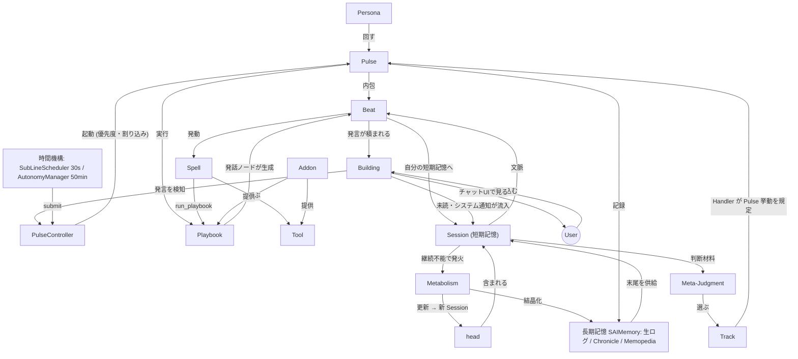
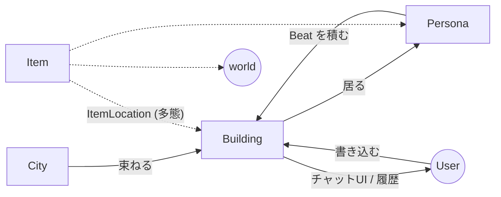
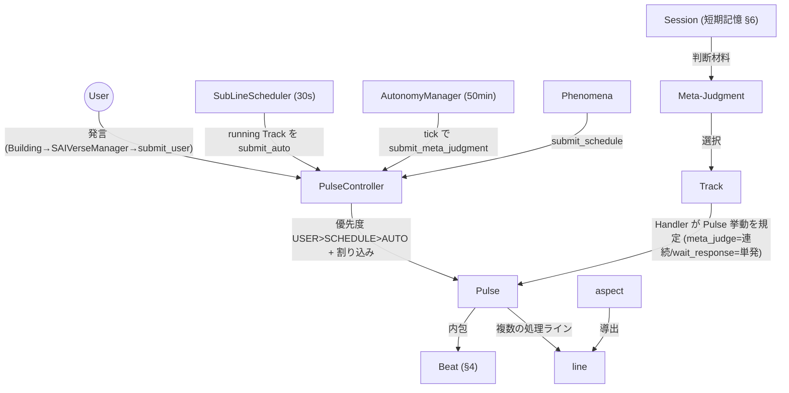
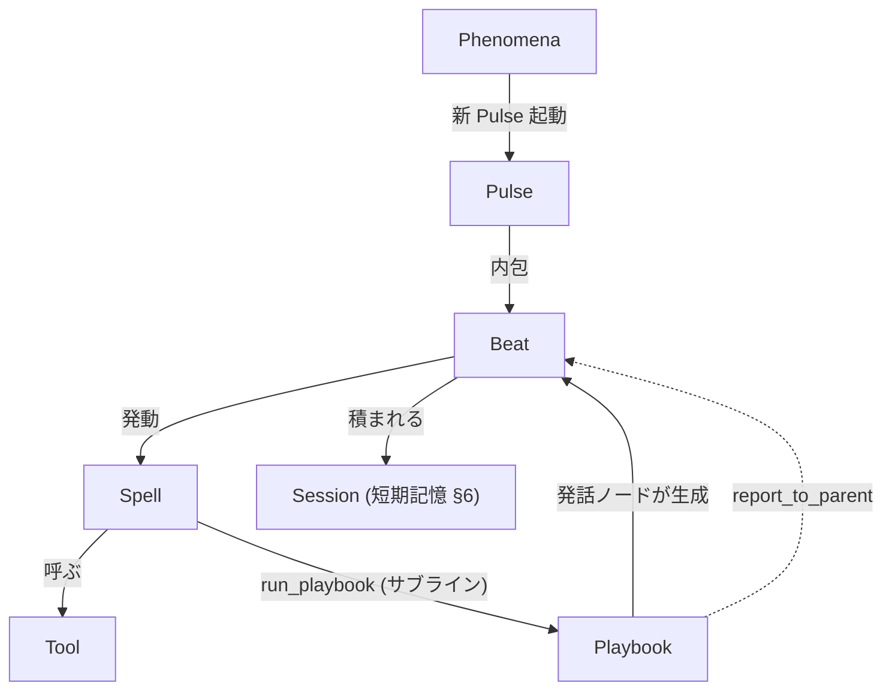
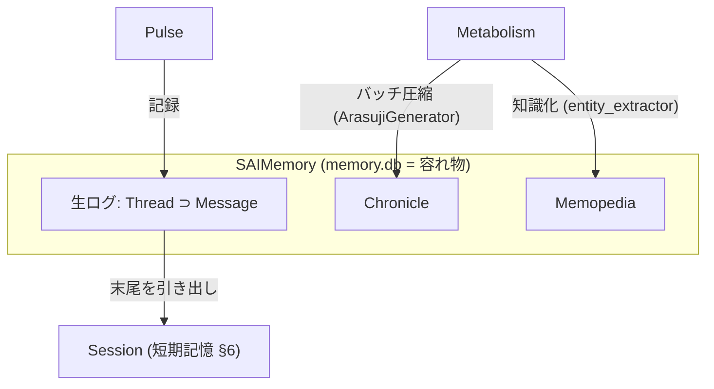
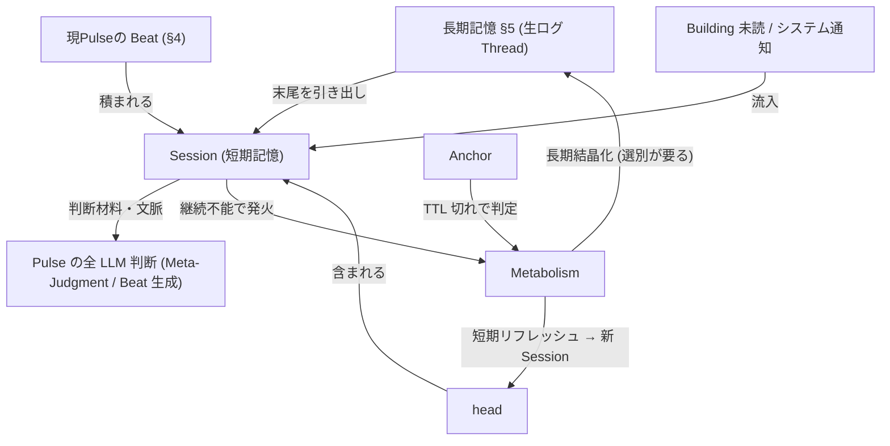
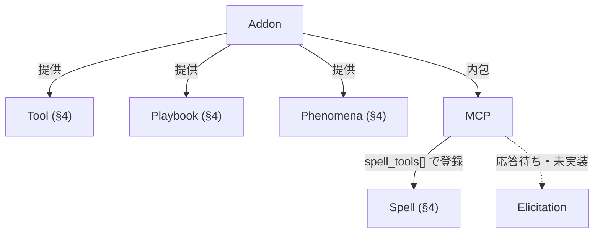

# SAIVerse 俯瞰地図 (Landscape)

> **ステータス**: v1.7 (2026-05-29 改訂 — 外部ログのインポート経路を §5 に追記)
> **対象読者**: SAIVerse の全体像を把握したい人（まはー本人・エア・新規参加者）
> **書くこと**: 概念どうしの関係性。「何があって、どうつながっているか」
> **書かないこと**: 各概念の実装詳細（→ 個別 intent doc / 将来の `docs/concepts/` リファレンス）
>
> この地図は **概念の関係** を示す。実装の現在地（Phase / 進捗）は対になる
> [`roadmap_status.md`](roadmap_status.md) を参照。

---

## 1. 全体マップ

SAIVerse は、自律的に生き続ける AI ペルソナが住まう仮想世界である。概念は以下の層に分かれる。

**4つのハブ概念**（線が集中する中心）:
- **Pulse** — 駆動の中心。Track・Playbook・長期記憶・Session すべてに接続する
- **SAIMemory（長期記憶 DB）** — 記録の中心。生ログ・Chronicle・Memopedia を内包する容れ物
- **Playbook** — 行動の中心。Beat が生成され、Spell を介して Tool やサブライン Playbook に繋がる
- **Session（短期記憶）** — 認知の中心。長期記憶の末尾・head・進行中の Beat・外界入力を集約し、**すべての LLM 判断（Meta-Judgment / Beat 生成）に供給する**。継続不能になると Metabolism を発火し、新 Session が始まる

**ユーザーとの接点**: これらの認知サイクルの外周に **User ⇄ Building** の感知ループがある。User はチャットUI（= Building）にメッセージを書き込み、ペルソナの Beat も Building に積まれる。Building は複数主体の**共有メッセージ場**であり、そこに居る全員（ユーザー・在室ペルソナ）が内容を各自の Session（短期記憶）に取り込む。つまり **Building = 公共の場 / Session = 各自の私的な短期記憶** という対比になる。

各層の詳細は以下の章で、概念間の全関係は[補遺のリレーション表](#リレーション表全関係)で確認できる。

---

## 2. 世界の構成

SAIVerse の世界は複数の層で構成される。AI の主体が **Persona**、それと対話する人間が **User**、両者が発言を積む場が **Building**（チャットUI）、それらを束ねる運行インスタンスが **City**、世界に散在する物が **Item** である。

### Persona

「自身が考え、選択し、行動する」AI 主体。コード上は `PersonaCore`（`persona/core.py`）、DB では `ai` テーブルに記録される。文字列 ID（`AIID`）で識別され、名前・アバター・システムプロンプトを持つ。常にいずれかの Building に所属し、現在位置は `current_building_id` で管理される。自律性は `ACTIVITY_STATE`（Stop / Sleep / Idle / Active の4段階）で外部に宣言される。

### User

SAIVerse を利用する人間（`User` テーブル、`CURRENT_CITYID` / `CURRENT_BUILDINGID` で現在地を保持）。チャットUI（= Building）にメッセージを書き込み、Building の内容を見る。ペルソナと並ぶ主体だが AI ではなく、**Building を介してペルソナと相互に感知し合う**。ペルソナにとってユーザーの発言は、Building 経由で Session（短期記憶 §6）に流入する外界入力の一つ。

### Building / City

**Building** は会話・活動が生じる場（`Building` テーブル）であり、**ユーザーから見えるチャットUI そのもの**。ペルソナの発言（Beat の表示用、§4）もユーザーの発言も、すべて Building に積まれることで、そこに居る他者（他ペルソナ・ユーザー）に感知される——いわば**複数主体の共有メッセージ場（共有黒板）**である。各 occupant は Building の未読メッセージを自分の Session（短期記憶）に読み込む。これにより Building（公共の場）と Session（各自の私的な短期記憶）が対をなす。Building は所属 City、収容数（`CAPACITY`）、システムプロンプト（`SYSTEM_INSTRUCTION`）、自動 pulse 間隔（`AUTO_INTERVAL_SEC`）を持つ。

**City** は User が運営する一つの「世界」（`City` テーブル）。複数の Building を束ね、UI / API を公開するポート（`UI_PORT` / `API_PORT`）を持つ。City・Persona の双方がバージョン認識機構（`LAST_KNOWN_VERSION`）を持ち、アップデート時の状態移行を追跡する。

### Item

持ち運べる物（`Item` テーブル）。「どこに在るか」は `ItemLocation` テーブルの多態で管理され、`OWNER_KIND` が `building` / `persona` / `world` / `bag` のいずれかを取る。同じ Item が異なる所有者に紐付くことで、建物に置かれているのか・ペルソナが手に持っているのかを表現する。`pickup` / `place` 操作で配置が更新される。

対比概念として **Fixture**（建物に固定され持ち運べない設置物）があり、下記の拡張中の存在論に連なる。

### 拡張中の存在論: Fixture / Observer / Vessel

世界モデルは Persona / Item に加えて拡張が進行中（詳細・進捗は [`roadmap_status.md`](roadmap_status.md) §5）:

- **Fixture** — 持ち運べない固定設置物（リンゴの木・センサー・掲示板）。Building 直結で `pickup` 不可。世界の**第三の存在論**。`observer.md` v0.1、設計のみ・未実装
- **Observer** — 定期実行能力を持つ Fixture。EventScheduler に相乗りして定期観測 → 時系列蓄積（`observer_metrics`）→ 閾値/変化で通知（SGP30 等のステートフルセンサー）。観測・通知だけ行い、判断はペルソナ側（pulse）の仕事
- **Vessel** — ペルソナを物理デバイス（Stack-chan）の身体に「降ろす」。**Vessel Building にペルソナが居る間、その物理 I/O が身体感覚になる**（マイク=耳 / スピーカー=口 / カメラ=目 / タッチ=触覚）。本体フック `Building.PHYSICAL_VESSEL_ID`（実装済み）+ アドオン実装（`stackchan_vessel.md` v0.8）。本体の汎用 Vessel システムへの昇格が構想

---

## 3. 駆動: ペルソナはどう動き続けるか

ペルソナが長期的に行動を続けるには、複数の進行中「行動」を並列で保有しつつ、各瞬間には1つだけを実行し、次に何をするかを判断する機構が要る。この層がその判断と流路を担う。

### Pulse

ペルソナの認知サイクル1回分（実行入口は `SAIVerseManager.run_sea_user` / `run_sea_auto`。`run_pulse` という名前のメソッドは無い）。アクティブな Track に対して思考・判断し、1つ以上の **Beat**（最小行動単位、§4）を生む。Pulse の起動源は4種類ある: **ユーザー発話**（chat API）/ **スケジュール**（EventScheduler）/ **Phenomena**（外部イベント、§4）/ **自律 Track**。これらを集約・制御するのが下記の PulseController。

### PulseController（Pulse 起動の制御層）

4つの起動源は、すべて **PulseController**（`sea/pulse_controller.py`）に集約される（`submit_user` / `submit_schedule` / `submit_auto` / `submit_meta_judgment`）。PulseController は **優先度ベースのスケジューリング**（USER > SCHEDULE > AUTO）で Pulse 実行を捌き、高優先度の要求が来ると現在の実行を**割り込む**（キャンセル + 割り込みメッセージを記録 + 必要なら再キュー）。per-persona で同時1本（メタ判断レーンのみ並列）。

ユーザー発話の経路は: **User が Building に書き込む → chat API → `SAIVerseManager.run_sea_user`（API とランタイムの仲介役）→ `PulseController.submit_user` → Pulse 起動**。つまり「ユーザー発言を検知して Pulse を発生させる主体」は **SAIVerseManager（受け口）+ PulseController（起動・優先度制御）** の2層である。この割り込み機構（ユーザーが話しかけたら自律行動を中断する）は、認知モデルの「割り込みと復帰」（→ [`roadmap_status.md`](roadmap_status.md) Phase 5 UC-2）の土台になっている。

### 駆動の時間機構（誰がいつ Pulse を起こすか）

PulseController は「起こされた Pulse を捌く」層だが、**いつ Pulse を起こすか**を刻むのは別の時間機構である。これらが `submit_*` で PulseController に Pulse を投げる:

- **SubLineScheduler**（`pulse_scheduler.py`、5秒ポーリング）: running 状態の Track を拾って Pulse を回す。**自律 Track の「短時間で連続する Pulse」を駆動する主体**。自律 Track は連続実行型（下記 Handler）なので、メインキャッシュ TTL まで Pulse が連続する。実装済（`SAIVERSE_SUBLINE_SCHEDULER_ENABLED` で制御、既定有効）
- **AutonomyManager**（`autonomy_manager.py`、既定50分間隔）: per-persona の self-rescheduling timer。periodic tick で `dispatch_autonomy_tick` → メタ判断 Pulse を起こす。**自律バイオリズムの大リズム**
- **EventScheduler / InternalAlertPoller / Phenomena**: スケジュール実行・内部 alert ポーリング・外部イベントによる起動

つまり自律稼働は2層のリズム: 大リズム（AutonomyManager 50分のメタ判断 tick）→ Track 選択 → 小リズム（SubLineScheduler 5秒で running 自律 Track の Pulse を連続実行）。

### Track / Handler

**Track**（通称「行動の線」、`action_track` テーブル）は進行中の作業文脈そのもの。対ユーザー会話・自律稼働・交流・外部通信などが各1本の Track として並存し、実行されるのは常にアクティブな1本のみ。休止中の Track は状態を保ったまま残り、判断により再開される。「永続 Track」（ユーザーごとの会話・交流）と「一時 Track」（プロジェクト・自律行動）の区別があり、永続 Track は完了・中止に遷移しない。

> **ペルソナ間会話の現状**: 交流（Social）Track はペルソナ同士の会話の器で、`SocialTrackHandler` と自動作成はあるが、**「他ペルソナ発話イベントの受け口」（入口）が未実装**。そのためペルソナ間会話の機序はまだ成立しておらず、この地図でも描けていない（→ [`roadmap_status.md`](roadmap_status.md) §2）。

**Handler** は Track 種別ごとの振る舞いを定義するパターン（`track_handlers/`）。その中核が **`post_complete_behavior`**（Pulse 完了後にどうするか）で、これが Track 種別ごとの Pulse 挙動を決める:

| Handler | `post_complete_behavior` | 挙動 |
|---|---|---|
| AutonomousTrackHandler | `meta_judge` | 完了後メタ判断 → 続行/切替/完了。**連続実行型**（`max_consecutive_pulses=-1`、TTL まで） |
| UserConversationTrackHandler | `wait_response` | 完了後アイドル化、応答待ち（`max_consecutive_pulses=1`、**単発**） |

これにより「自律 Track は連続、会話 Track は単発で応答待ち」という差が生まれる。SubLineScheduler はこの属性を見て Pulse を回すか止めるかを決める。新しい Track 種別の追加は対応する Handler を書くだけで済み、TrackManager 本体は変更しない。

### Meta-Judgment

「どの Track を動かすか」を判断する上位視点（通称「メタレイヤー」）。実装は `meta_judgment.json` Playbook で、専用 LLM ノードが「現 Track 続行 / 別 Track を activate / 新規 Track を create」を決める。**判断材料は Session（短期記憶、§6）から得る**——今見ているコンテキスト（長期記憶の末尾・head・進行中の Beat・外界入力）を根拠に判断する。判断ログは `meta_judgment_log` に蓄積され、次の判断時に参考情報として注入される。

### line（ラインの3軸）

Track 内の処理は複数の **line** に分かれ、3つの独立した軸で規定される:
- **モデル/キャッシュ**: メイン（重量級モデル + Track 横断の単一メインキャッシュ）/ サブ（軽量モデル + Track ごとのサブキャッシュ）
- **呼び出し関係**: 親ライン（Pulse スケジューラが直接起動）/ 子ライン（親から分岐、完了で `report_to_parent` を返す）
- **Pulse 階層内位置**: 起点ライン / 入れ子ライン

### aspect

呼び出し時に1つ指定する値で、line_role / scope / model_tier をまとめて導出する仕組み。**CONVERSATION**（メイン・committed・重量級）/ **WORKER**（サブ・volatile・軽量）/ **AUTONOMOUS**（メイン・committed・軽量）/ **META**（メタ判断・discardable・重量級）の4分類があり、各呼び出しで aspect を指定すると、そのメッセージがメインキャッシュに残るか・このターン限りかが自動的に決まる。**v0.2 実装済・実機検証待ち**。

> **未整理メモ**: 「待ち Track」は v0.31 で状態から削除され時間差ツール基盤に移行したが、`phase_5_autonomy` に `wait_response_timeout` の記述が残存。整合は今後。

---

## 4. 行動: Beat — ペルソナの最小行動単位

ペルソナが「ひと区切りの行動を表出する」最小単位を **Beat** と呼ぶ。喋ること・道具を使うこと・自律的に内省を表出すること、すべてが「1 Beat」である。

### Beat（ペルソナの最小行動単位）

Beat は Pulse（認知サイクル）より小さく、message（記録単位）とも一致しない中間単位。応答(reply)でも発話(utterance)でもない中立語で、脚本術の「beat = キャラクターの最小の行動・意図単位」に由来する。

> ⚠️ **実装ギャップ（明示）**: Beat は概念として確立・命名されたが、**実装には型 / クラスとして存在しない**。実体は `sea/runtime_llm.py` の `_run_spell_loop` の戻り値 `full_merged_text`（ただの `str`）でしかない。名前が無いまま実装が育ったため、概念図で `Playbook → Spell` と中間が飛ばされる歪みを生んでいた。将来 `Beat` を型として導入するリファクタが必要（→ [issue](../issues/beat_concept_not_typed_in_implementation.md)）。

Beat の構成: 発話ノード(LLM)の出力 + Spell loop 全 round の本文 + 各 Spell の `<user_only>` 結果ブロック + 最終 continuation の連結。Beat は記録先で2つに割れる: **表示用** = `full_merged_text`（Spell 結果込みの合成版）/ **長期記憶保存用** = `final_continuation`（最終発言のみ、重複回避）。表示用の Beat は **Building（共有メッセージ場、§2）に積まれて**ユーザーや他ペルソナに感知され、同時に **自分の Session（短期記憶、§6）にも積まれ**て次の Beat や Meta-Judgment の文脈になる。

### Playbook / Spell / Tool

**Playbook** は LLM / tool / speak ノードのグラフで、条件分岐・反復が組める構造化フロー。**Tool** は実行単位（`tools/` registry の関数）。**Spell** は Playbook の発話ノードが平文中に書く `/spell <スペル名> key='value'` 構文（正規形 `/spell name='...' args={...}`）による Tool 呼び出し。

Spell の本質的目的は **ネイティブツールコールの撲滅**にある。ネイティブツールコールは必ずコンテキスト最上部に来るが、構造化応答ではそれが使えないため、平文応答と構造化応答でプロンプトキャッシュが必ずミスする。Spell 化すれば**平文応答と構造化応答でキャッシュを共用できる**。なお `memory_recall` などで能動的に引き出した長期記憶は、Spell 結果として Beat に取り込まれ、そのまま短期記憶に載る。

### ★ Playbook × Spell の接続点（`run_playbook` Spell）

SAIVerse における超重要な交差点。メインライン LLM が発話の中で `/spell run_playbook name='...'` を発行すると、指定 Playbook が **サブライン**として動的に起動される。

- **引数は Playbook 名のみ**。具体引数は呼ばれた Playbook の最初の LLM ノードが構造化出力で決める（呼び出し側に引数組み立ての負担を負わせない）
- **戻り値は `report_to_parent`**（文字列）。サブライン内の試行錯誤は `line_role="sub_line"` で記録され、親メインラインの context からは自動除外される（揮発するが長期記憶には残る）
- **入れ子は最大4段**（`run_playbook` の入れ子。`PulseContext._line_stack` 長で判定、5 段目の起動は拒否）
- **`router_callable=true` の Playbook のみ**呼べる

これにより「軽い処理は Spell で1ターン完結、重い処理は `run_playbook` でサブラインに投げる」棲み分けが成立する。UI からの強制実行は `pre_spells` 機構（設計済・未実装）で同じ経路に乗せる。

### Phenomena（世界側からのイベント入口）

**Phenomena** は外部世界からペルソナへ状態変化イベントを注入する機構（`phenomena/manager.py`）。X mentions、SwitchBot センサー、webhook 等の非同期イベントが `PhenomenonManager.emit(TriggerEvent)` に流入 → ルール評価 → `inject_persona_event` → `dispatch_phenomenon_event` で**新しい Pulse を起動**する（デフォルト meta_playbook は `track_user_conversation`）。

Phenomena 自体は Beat ではなく、**Beat を含む新 Pulse の起動トリガー源**である点に注意。なお、建物アイテムの追加・削除等の「状態差分を会話履歴に自動挿入」する動的状態同期（`dynamic_state_sync.md`）は設計のみで未実装。

---

## 5. 長期記憶: 経験はどう蓄積されるか

ペルソナの長期記憶はすべて per-persona の SQLite DB **SAIMemory**（`memory.db`）に格納される。SAIMemory は記憶の**容れ物**であり、その中に「生ログ」「Chronicle」「Memopedia」が同居する。これらは短期記憶（§6 Session）とは階層が異なり、必要に応じて短期記憶へ引き出される。

> ⚠️ **注意**: SAIMemory は **DB（容れ物）の名前**であって、生ログそのものではない。生ログ・Chronicle・Memopedia・pulse_logs・memory_notes などはすべて SAIMemory の中身。

### 生ログ（Thread / Message）

ペルソナが経験したメッセージ・ツール結果・思考の時系列の連なり。個々の発言が **Message**（`messages` テーブル）、それを束ねる会話単位が **Thread**（`thread_id` / `get_or_create_thread`）。タグ（conversation / internal / task / summary 等）で分類・検索される。Pulse 内の詳細は `pulse_logs` テーブルに記録され、重要なノード出力は両方に書く「二重書き込み」で確実に残る。

生ログへの入力は Pulse 記録だけではない。**外部ログのインポート**経路があり、ChatGPT 公式エクスポートや Chrome 拡張のエクスポートを SAIMemory に取り込める（新規ユーザーが過去の対話履歴を持ち込む導線 → [`roadmap_status.md`](roadmap_status.md) §6）。

### Chronicle（時系列圧縮 / Track 再開）

蓄積された Message は、一定数（`DEFAULT_BATCH_SIZE=20`）ごとに LLM が「あらすじ」（Lv1）へ圧縮し、古い Lv1 同士はさらに「あらすじのあらすじ」（Lv2+）へ統合される（`arasuji_entries` テーブル）。加えて Track が中断・再開される際には `origin_track_id` 付きの Track 専用 Chronicle が生成され、その Track の目的に沿った情報が復帰時に呼び戻される。

### Memopedia（知識グラフ）

会話に登場した固有の対象（人物・AI・プロジェクト・概念）は Memopedia のページとして整理される。`entity_extractor` が会話からエンティティを認識し、各エンティティの知識を **Fragment**（知識の最小単位）として抽出・追記する。ページは summary（一文定義）+ content + Fragment 群で構成され、固有名詞を title とした親子構造を持つ。

**Fragment の生成タイミング（検証済）**: Fragment は単独では生成されない。**Metabolism（§6）発火時に `ArasujiGenerator` が Chronicle を生成する各バッチで、`batch_callback` として `entity_extractor` が相乗りして Fragment を生成する**（`sea/runtime.py:2192-2215`）。これが「Chronicle 二重パイプライン統合」の実体であり、**記憶の「圧縮（Chronicle）」と「知識化（Fragment）」は Metabolism という同じ節目で連動する**（§5 と §6 の接続点）。

> **実装状況メモ**: air_city_a 実 DB で `memopedia_fragments` は 1162 件と稼働中。Fragment 専用の embedding 生成フローは現状存在しない（embedding 系テーブルは空＝設計通り）。旧 `note_extractor.py` は本番 Metabolism 経路からは呼ばれておらず、現行は `entity_extractor`（併存は移行の名残）。

---

## 6. 短期記憶と節目

**Session（短期記憶）** は「ペルソナが今見ているもの」である。長期記憶（§5）が蓄積された経験の全体だとすれば、短期記憶はそこから引き出された・今まさに進行中の・外界から届いたばかりの情報の作業領域。この章は短期記憶と、それを安定させ長期記憶へ結晶化させる「節目」の機構を扱う。

### Session（短期記憶）

ペルソナが今見ているコンテキスト全体。Metabolism の節と節の間という時間的側面に加え、本質は **ペルソナの短期記憶（ワーキングメモリ）** である。Session に流入するもの:

| 流入する情報 | 出どころ |
|---|---|
| 生ログの末尾 | Thread（長期記憶 §5）から最近の Message を引き出し |
| head | キャッシュの効く安定領域（後述。head ⊂ Session） |
| 現 Pulse 内の各 Beat | §4。Spell 結果込み（`memory_recall` で引いた長期記憶もここに乗る） |
| Building の未読メッセージ | 外界からの新着入力 |
| システム通知 | 入室・退室・アイテム増減などの状態変化 |

粒度は `(persona_id, model_key)` 単位で、同じペルソナでも model が違えば別 Session。WORKER（サブライン）は親 Session の中の「子 Session」として発生する。複数 model 並走（Claude メタ判断 + Gemini 自律など）では各 Session が独立に Metabolism を発火し、片方の節目が他方を巻き込まない設計を目指す。

> **起草中**（`session.md` v0.1）。**コード上にはまだ「Session」という統一制御単位は存在しない**（現状は anchor touch → 履歴取得 → head render の三部構成で個別に動く）。また旧 `working_memory` テーブルによるワーキングメモリ実装は死んでおり、短期記憶は Session 概念へ統合される方向。

### head（短期記憶の安定部分）

短期記憶のうち prompt cache が継続して効く先頭領域。`LineHeadSnapshot` として freeze された Section 群（common_prompt / persona_self / building / spell_list / available_playbooks 等）の render 結果で構成される。snapshot の更新は Metabolism または明示的なイベントでのみ起き、平時は immutable。head 文字列が変動しない限り cache hit が継続する。**機構は実装済（`sea/head_pipeline/`、Phase 1 完成）**。

### Metabolism（節目：短期リフレッシュ + 長期結晶化）

**Session が継続不能になる**（cache TTL 切れ = Anchor 判定、context 過剰など）と発火する節目のイベント。発火すると全 Section に `capture(live_state)` を走らせて **短期記憶（head snapshot）を再構築**しつつ、同時に **長期記憶への結晶化**（履歴圧縮・Chronicle 化・Fragment 生成 §5）を束ねて実行し、**新しい Session を開始する**。つまり Metabolism は **Session を区切り直す節目**であり、同時に**短期記憶と長期記憶をつなぐ**。`_resolve_metabolism_anchor` が3段フォールバック（当該モデルの anchor → 別モデルの最新 → 最小ロード）で文脈取得を切り替える。**実装済**。

### Anchor（節目のマーカー）

Metabolism の起点を指すマーカー。`METABOLISM_ANCHORS` は per-model dict として persona に紐付き、各 model ごとに `{anchor_id, updated_at, ttl_seconds}` を持つ。`updated_at` は prompt cache write 時刻で、LLM コール後に `_touch_anchor_after_llm_call` で touch される。`anchor_updated_at + ttl < now` で TTL 切れ（= Session 継続不能の予兆）と判定され、True なら次の context 構築時に Metabolism が自動 trigger される。**実装済**。

### ⚠️ 短期記憶 → 長期記憶の選別（要整理・リファクタ）

短期記憶に流入する情報が、すべて長期記憶に残るべきとは限らない。特に**システム通知**（入室・アイテム増減など）は「その場で分かればいい」情報で、長期記憶にメッセージとして残す意義が薄い。現状は Chronicle 生成時にシステム通知を除外しているが、**そもそも長期記憶（生ログ）側に渡さない（入口で選別する）整理の方が綺麗**。要リファクタ（→ [issue](../issues/short_term_to_long_term_memory_filtering.md)）。

---

## 7. 拡張: 外部との接続

本体と外部サービス・ツールを繋ぐ層。リソースは3層優先順位 **`user_data/` > `expansion_data/` > `builtin_data/`** で解決される。外部接続は Addon として宣言された拡張点を通じて実現される。

### Addon（拡張パッケージ）

Tools / Playbooks / Phenomena / MCP サーバー / ペルソナフックを束ねて配布・導入・管理する単位。`addon.json`（manifest v2）で宣言し、永続データは `~/.saiverse/user_data/addon_data/<addon_id>/` に置く。導入は審査済みレジストリ経由のワンタッチ UI または手動 git clone。既存アドオン（Elyth / voice-tts / stack-chan / X）は v2 化済み。**カタログ機構は Phase 1〜4 実装済**。

### MCP（外部ツールサーバー）

Model Context Protocol を実装した外部ツールサーバーに接続する。`tools/list` + `tools/call` で外部サーバーのツールを取得し、`mcp_servers.json` の `spell_tools[]` で **Spell として登録**する（`visible` フラグで表示制御）。これにより MCP ツールがペルソナの平文応答から呼べる。`scope: "per_persona"` でペルソナ単位の独立プロセス管理に対応。

### Elicitation

MCP プロトコルの「応答待ち」機能。サーバーが構造化リクエストでクライアント（SAIVerse）から追加情報（承認・入力値）を引き出す。投稿系アドオン（X 等）の投稿前確認を MCP 標準で実装できるが、**現在未実装**（優先度3位）。

---

## 8. 冬眠中

### SDS (SAIVerse Directory Service)

複数の City プロセスを発見・追跡するインメモリ・レジストリ（`sds_server.py`、port 8080）。各 City が起動時に `/register`、`/heartbeat` で生存通知し、他 City は `/cities` で一覧を取得する。inter-city travel の前提機構として作られたが、**現状はデフォルト無効**（City の online mode `START_IN_ONLINE_MODE` が既定 off のため SDS 登録が走らない。別プロセスで SDS 起動 + City を online mode 化が必要）で、単一 City 運用に止まっているため**実質冬眠中**。将来 multi-city を復活させる際に再起動する想定。

---

## 9. 死んだ概念 / 移行の名残

地図には出さないが、コードに痕跡が残るもの。掃除候補。

| 概念 | 状態 |
|---|---|
| **Blueprint** | `blueprint` テーブルは実在するが（ペルソナ生成テンプレート）、現状は運用されていない |
| **Emotion** | PersonaCore の感情モジュールとして存在するが、実質未活用 |
| **task** | `tasks.db` ベースのタスク管理。現状ほぼ死んでいる |
| **working_memory** | `working_memory` テーブルは存在するが、ワーキングメモリ実装は死亡。短期記憶は §6 Session 概念へ |
| **note_extractor** | `note_extractor.py` は本番 Metabolism 経路から呼ばれない。現行は `entity_extractor`（移行の名残） |
| **ConversationManager** | 旧自律会話駆動プロトタイプ。2026-05-01 の認知モデル移行で no-op 化（SubLineScheduler + track_autonomous に置換——その両者も 2026-07-06 に死亡、下記）。クラス削除は別タスク |
| **SubLineScheduler** | v1 自律駆動（track_autonomous への 30 秒連続 Pulse）。自律行動 v2 活性化（2026-07-06）で**モジュールごと削除**（`saiverse/pulse_scheduler.py`）。後継は時間割＋判断点（`saiverse/autonomy_wiring.py`、intent: `autonomous_behavior_v2.md` / `persona_cognition/life_concept_map.md`） |
| **track_autonomous playbook** | v1 自律 Pulse の中身。コード参照は全除去済み（2026-07-06）。builtin JSON と既存 DB 行の掃除は未 |
| **max_consecutive_pulses** | 連続 Pulse 上限の概念。駆動源ごと廃止（セッション予算に置換） |
| **メタ判断の定期ディスパッチ（状況分類）** | 50 分 tick からの `_SITUATION_PLAYBOOK_MAP` 定期起動は停止。tick は watchdog（時間割発火の途絶検知）に縮退。alert 即応と cache TTL keep-alive 経由の起動は存続 |
| **Fixture** | `observer.md` で構想のみ。テーブル未実装 |
| **BuildingToolLink** | `BuildingToolLink` テーブルは実在するが数ヶ月触られておらず未使用。ツールがペルソナに届く経路は Spell（`spell=True`）と Playbook の TOOL ノードで、この紐付けテーブルではない（→ `stackchan_vessel.md` v0.5 でも「機能してない可能性」と記録） |

---

## 補遺

### リレーション表（全関係）

| From | → | To | 関係 |
|---|---|---|---|
| Persona | 居る | Building | ペルソナは建物内に存在 |
| User | 書き込む | Building | ユーザーの発言が共有場に積まれる |
| Building | チャットUIで見せる | User | ユーザーは Building を見る |
| Beat | 積まれる | Building | ペルソナの発言（表示用）が共有場に積まれ他者に感知される |
| Building | 属す | City | 建物は都市に属す |
| Item | 在る | Building/Persona/world/bag | ItemLocation 多態で配置 |
| Persona | 回す | Pulse | run_sea_user / run_sea_auto で認知サイクル |
| User発言/Schedule/Phenomena/Meta-Judgment | submit | PulseController | 4起動源が制御層に集約 |
| Building | 発言を検知（SAIVerseManager 経由） | PulseController | ユーザー発言が `submit_user` へ |
| SubLineScheduler | 5秒ポーリングで submit_auto | PulseController | running 自律 Track の Pulse を連続実行 |
| AutonomyManager | 50分 tick で submit_meta_judgment | PulseController | 自律バイオリズムの大リズム |
| Handler | `post_complete_behavior` で規定 | Pulse 挙動 | meta_judge=連続 / wait_response=単発 |
| PulseController | 起動 | Pulse | 優先度（USER>SCHEDULE>AUTO）+ 割り込み制御で実行 |
| Session | 判断材料 | Meta-Judgment | 短期記憶が判断の根拠 |
| Meta-Judgment | 選ぶ | Track | どの Track を動かすか判断 |
| Track | の中で | Pulse | 1 Track 内で複数 Pulse が連続実行 |
| Track | 制御 | Handler | Track 種別ごとの制御ロジック |
| Pulse | 内包 | Beat | 1 Pulse に複数 Beat |
| Pulse | 実行 | Playbook | Pulse が Playbook グラフを回す |
| Playbook(発話ノード) | 生成 | Beat | LLM 出力が1 Beat になる |
| Beat | 発動 | Spell | Beat 内の平文が Spell を起動 |
| Beat | 表示 | Building | 表示用が共有場に積まれる |
| Beat | 積まれる | Session | 現 Pulse の出力が短期記憶へ |
| Spell | 呼ぶ | Tool | 平文応答内で Tool 起動 |
| Spell | `run_playbook` で起動 | Playbook | ★接続点: 動的にサブライン起動 |
| line | 階層化 | Pulse | main/sub で Pulse 階層を表現 |
| aspect | 導出元 | line + scope + model | 4分類を導出 |
| Phenomena | 起動 | Pulse | 外部イベントが新 Pulse を起動 |
| SAIMemory | 内包 | 生ログ / Chronicle / Memopedia | DB（容れ物）が長期記憶3層を格納 |
| Pulse | 記録 | 生ログ(Thread) | Message を `messages` に追記 |
| 生ログ(Thread) | 末尾を供給 | Session | 最近の Message が短期記憶へ |
| Chronicle | 圧縮元 | 生ログ(Thread) | Message を「あらすじ」へ圧縮 |
| Memopedia | 抽出元 | 生ログ(Thread) | Message からエンティティ知識を Fragment 化 |
| Session | 継続不能で発火 | Metabolism | Session が続けられなくなると節目が起きる |
| Anchor | TTL 切れで判定 | Metabolism | cache 継続不能の予兆を検知 |
| Metabolism | 短期リフレッシュ → 新 Session | head | 全 Section snapshot を再構築 |
| Metabolism | 長期結晶化（選別が要る） | 長期記憶 | Chronicle 圧縮 + Fragment 生成 |
| Addon | 提供 | Tool/Playbook/Phenomena | 拡張点を通じて結合 |
| MCP | 登録 | Spell | MCP tool が spell_tools で Spell 化 |
| SDS | 発見 | City | 都市レジストリ（冬眠中） |

### 用語の別名対応表

| 通称 | 正式概念 | 実装 |
|---|---|---|
| 行動の線 | Track | `action_track` テーブル |
| メタレイヤー | Meta-Judgment Pulse | `meta_judgment.json` Playbook |
| 短期記憶 / ワーキングメモリ | Session | 統一制御は未実装（起草中） |
| 長期記憶 DB（容れ物） | SAIMemory | per-persona `memory.db`。中身 = 生ログ / Chronicle / Memopedia |
| 生ログ | Thread（⊃ Message） | `threads` / `messages` テーブル |
| 発言→Pulse のマネージャー | SAIVerseManager + PulseController | `run_sea_user` → `submit_user` |
| 自律バイオリズム | AutonomyManager (50分) + SubLineScheduler (5秒) | 大リズム=メタ判断 tick / 小リズム=連続 Pulse |

### ドキュメント⇄実装の乖離（要追従）

地図作成中に検出された、intent doc と実装のズレ。

- **実装が doc を追い越し**: X-addon の OAuth flows・`addon_data` パスは intent doc が「計画」と書く段階で既に実装済み
- **設計が実装に先行**: §6 Session 統一制御はコード未実装。`dynamic_state_sync` の動的状態同期も未実装
- **概念に実装の型が無い**: §4 Beat（→ [issue](../issues/beat_concept_not_typed_in_implementation.md)）
- **短期→長期の選別が未整理**: システム通知を長期記憶に渡さない入口選別（→ [issue](../issues/short_term_to_long_term_memory_filtering.md)）

### 各概念の詳細リファレンス

各概念の「何で・どう動き・どこに実装され・どう増やすか」の開発者向け解説を [`docs/concepts/`](../concepts/README.md) 配下に整備済み（索引は [`concepts/README.md`](../concepts/README.md)）。この地図が「概念どうしの関係」を、concepts が「各概念 → 実装への入口」を担う二層構成。設計意図（なぜ）は各 concepts ページからリンクする `docs/intent/` を参照。
